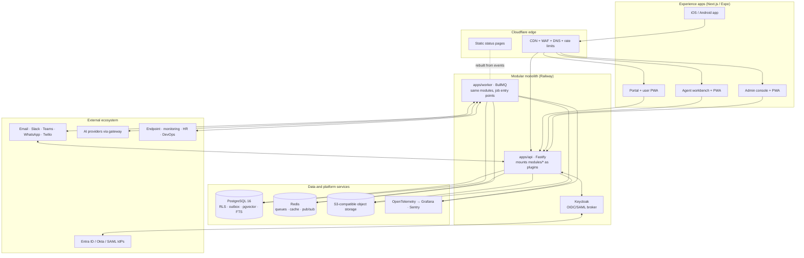

# 01 · Architecture overview

## 1. Purpose

The platform is a multi-tenant, browser-first IT service-management product: one canonical ticket record reachable from the portal, email, Slack, Teams, WhatsApp, voice, PWA and mobile apps, with configuration-first administration and governed AI. This document set defines the architecture that every phase builds on. It is deliberately complete for the foundations (tenancy, identity, ticket core, eventing, audit, notifications, search, observability, delivery) and deliberately open where later phases will learn from usage (search engine, transport, extraction).

## 2. Architectural drivers

The drivers below are derived from the specification (Parts 2, 4, 5, 7 and 10) and from the four inputs confirmed by the product owner in September 2026: hosting on **Railway with Cloudflare in front**, identity brokered by **self-hosted Keycloak**, tenant data resident in the **United Kingdom**, and the architecture delivered as **Markdown in the repository**.

| Driver | What it demands of the architecture |
|---|---|
| One operational record, channel-neutral | A single ticket/interaction model (MOD-04) owned by one module; every channel is an adapter that issues the same commands and renders the same events. |
| Configuration before code | Forms, rules, workflows, SLAs, approvals, templates and eligibility are versioned data interpreted at runtime, all sharing one expression language and one publish/rollback model. |
| Multi-tenant from day one | `tenant_id` on every row, enforced twice (PostgreSQL row-level security and a tenant-aware data client); tenant-prefixed keys in Redis, storage, search and queues; a release-blocking isolation suite. |
| Modular, extractable | A modular monolith whose modules are packages with manifests, owning their tables, communicating through service interfaces and events, deployable together now and separately later. |
| Reliable automation | Transactional outbox for events, inbox idempotency for consumers, durable workflow and timer state in PostgreSQL, replay tooling. |
| Governed AI | A single AI service with provider abstraction, prompt versioning, permission-filtered retrieval, evaluation gates, budgets, audit and a kill switch. |
| Secure by construction | Audit written in the same transaction as every change, hash-chained; permission checks in the service layer; secrets outside the repo; scanned attachments; classification-aware masking. |
| Small team, one language | TypeScript end to end; one monorepo; shared contracts and design system across web, worker, mobile and SDK. |
| Observable | Correlation and tenant identifiers on every request, job, event and log; SLOs for the domain signals that matter (outbox lag, timer lateness, notification hand-off, search freshness). |
| UK data residency | Region is a first-class tenant attribute; the initial deployment runs in the nearest Railway region (EU West, Amsterdam) under the UK adequacy basis, with a documented path to UK-located data stores. See [19 · Risks and decisions](19-risks-and-decisions.md#d-01). |

## 3. Quality attribute targets (headline)

The full mapping is in [18 · Quality attributes](18-quality-attributes.md). The headline targets that shaped structural choices:

| Attribute | Target | Structural consequence |
|---|---|---|
| Availability | API 99.9 % monthly; public status page independent of the API | Stateless API and worker replicas; static status page served from the edge |
| Latency | Ticket list p95 < 300 ms at 1 M tickets per tenant; ticket read p95 < 150 ms; search p95 < 200 ms | Composite tenant-first indexes, cursor pagination, search projection table, read models for analytics |
| Timeliness | Outbox lag p95 < 5 s; SLA warning lateness < 60 s; notification hand-off p95 < 30 s; search freshness < 5 s | Dedicated worker pools per queue family, partitioned minute scheduler, indexer fed by events |
| Isolation | No cross-tenant read or write, ever | Row-level security, tenant-aware client, key prefixing, isolation suite in CI |
| Durability | Zero data loss; every write durable before the API responds | Synchronous commit in PostgreSQL, WAL archiving, outbox in the same transaction |
| Recoverability | RPO ≤ 15 min, RTO ≤ 4 h (PH-4 test) | Point-in-time recovery, replayable outbox, rehearsed restore each phase |
| Evolvability | Add a module or channel without touching ticket core | Manifests, contracts package, event catalogue, adapter pattern |

## 4. The architecture on one page

**In words.** Cloudflare terminates TLS, filters traffic and caches static assets for three Next.js apps (portal, workbench, admin) and a static status site. All experiences, including the Expo mobile app, call one versioned REST API served by a single Fastify process that mounts every domain module as a plugin. The same module packages run inside a BullMQ worker process for asynchronous work: outbox publishing, workflow steps, SLA timers, notification dispatch, search indexing, attachment scanning, imports and AI jobs. PostgreSQL is the only source of truth (transactional data, outbox, audit, search projection, embeddings, analytics schema). Redis carries queues, caches, rate-limit counters and the pub/sub used for server-sent events. Object storage holds attachments uploaded directly via presigned URLs. Keycloak brokers OIDC and SAML identity providers per tenant. Everything emits OpenTelemetry.

## 5. Architectural style and principles

1. **Modular monolith with service-ready modules** (ADR-0001). One API deployable, one worker deployable, one database; modules are packages with strict boundaries so that extraction is a deployment change, not a rewrite.
2. **Command in, events out.** Every state change is a service-layer command executed under a `TenantContext`; every material change publishes a domain event through the outbox in the same transaction (ADR-0002). Modules integrate by calling each other's service interfaces synchronously or by consuming events asynchronously. They never touch each other's tables.
3. **PostgreSQL is authoritative; everything else is a projection** (ADR-0003). Search documents, embeddings, analytics facts, notification state and status pages are rebuilt from events and can be dropped and regenerated.
4. **Defence in depth for tenancy** (ADR-0004). Row-level security, the tenant-aware client, tenant-prefixed keys and the isolation suite each catch what the other misses.
5. **Configuration is data with versions.** Forms, rules, workflows, SLA and approval policies, templates and eligibility follow one *definition → immutable published version → rollback* lifecycle and one expression language, evaluated identically on server and client.
6. **The API is the product** (ADR-0008). No experience has a private back door; the web apps use the same contracts and SDK as partners.
7. **Async by default for anything slow or external.** Notifications, webhooks, connectors, AI, scans and imports run in the worker with retries, idempotency and dead-letter handling.
8. **Observability is a feature.** Correlation ID and tenant ID on every span, log and event; domain SLIs alongside golden signals (ADR-0007).
9. **Portability over vendor features.** Every hosted dependency sits behind an interface (identity broker, email, object storage, AI provider, search engine, bus transport) and every deployable is a container.

## 6. What is fixed now and what is deferred

| Fixed in this architecture | Deferred (with the phase that decides) |
|---|---|
| Monorepo layout, module contract, manifest schema | Search engine beyond PostgreSQL full-text (PH-3, OD-02) |
| Tenancy model, RLS design, tenant-aware client | Bus transport beyond outbox + BullMQ (PH-5) |
| Keycloak as identity broker; token and session model | Per-tenant AI provider and residency stance (PH-4, OD-04) |
| Event envelope, outbox/inbox, replay, webhooks | GraphQL read API (PH-5) |
| API standards, contracts package, OpenAPI pipeline | Multi-region cells (PH-5) |
| Audit chain, permission model, classification hooks | Commercial model and metering design (PH-3, OD-05) |
| Settings/flags framework, versioned-definition pattern | Email provider selection (PH-2 start, OD-03; recommendation given) |
| Workflow and timer execution models | Extraction candidates and order (PH-5, from measurement) |
| Hosting topology on Railway + Cloudflare; CI/CD stages | Hosting location for strict UK-at-rest residency (PH-1 week 1, D-01) |

## 7. How to change this architecture

Structural changes go through an ADR (see [`../adr/README.md`](../adr/README.md)). The documents here are updated in the same pull request as the ADR that changes them. Module-level decisions that do not cross a boundary are the owning squad's and live in the module's own `README.md`.
