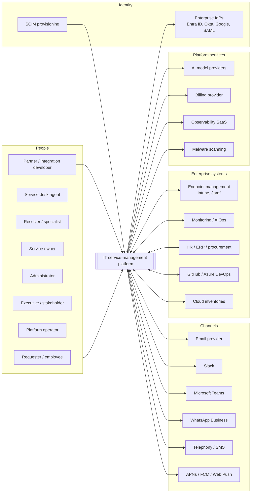

# 02 · System context (C4 level 1)

## 1. Context diagram

## 2. Actors

| Actor | Interacts through | Architectural implications |
|---|---|---|
| Requester / employee | Portal, email, Slack, Teams, WhatsApp, voice, PWA, iOS/Android | Identity verified before any ticket data is shown on a channel; "own" scope permissions; progressive disclosure; SSE for live timelines. |
| Service desk agent | Workbench, PWA, mobile, Teams, Slack | Team-scoped permissions; keyboard-first workspace; SLA and AI context assembled server-side per request. |
| Resolver / specialist | Work queues, linked records, push | Task ownership separate from ticket ownership; private collaboration threads. |
| Service owner | Service dashboards, catalogue builder, SLA workspace | Scoped roles ("own services"); versioned configuration with approval. |
| Administrator | Admin console, admin PWA | Settings framework, preview/validate/publish/rollback, admin activity log. |
| Executive / stakeholder | Dashboards, email, Teams, status page | Read models and subscriptions; no operational permissions. |
| Platform operator | Platform console, CLI, observability stack | Separate `/api/platform/v1` surface and database role; break-glass with alerts. |
| Partner / integration developer | REST API, webhooks, SDK, later OAuth apps and GraphQL | OpenAPI-first contracts, idempotency, rate limits per token, signed webhooks. |
| Non-human actors: integrations, workflows, AI agents, schedulers | Service layer under a system or integration actor | Every actor type is first-class in the audit `actor` field and in the event envelope. |

## 3. External systems and the boundary rules that apply

| System | Direction | Boundary rule |
|---|---|---|
| Identity providers (OIDC/SAML) | Inbound identity | Only Keycloak talks to IdPs. The platform trusts Keycloak-issued tokens, never channel-provided identity. |
| SCIM clients (Entra ID, Okta) *(PH-4)* | Inbound provisioning | `/scim/v2` is served by MOD-01 with a per-tenant bearer token; writes go through the same user service as the UI. |
| Email provider | Both | Inbound via signed webhook to `POST /api/v1/channels/email/inbound`; outbound via provider API with DKIM/SPF/DMARC; threading by `Message-ID` and a ticket token. Provider is behind an `EmailTransport` interface. |
| Slack, Teams, WhatsApp, telephony *(PH-4)* | Both | Each is a channel adapter module: signature verification, idempotency on the provider's message ID, identity mapping with verification, conversation state in PostgreSQL. |
| Push (APNs, FCM, Web Push) | Outbound | Delivered by the notification dispatcher; device tokens registered per user and platform. |
| Endpoint management, cloud, procurement *(PH-3)* | Inbound data | Connectors run in the worker through the integration gateway; records carry source and confidence; reconciliation never writes to ticket tables directly. |
| Monitoring / AIOps *(PH-4)* | Inbound events | Normalised alert schema; correlation attaches to existing incidents by fingerprint or CI. |
| HR / ERP / DevOps *(PH-4)* | Both | Connector framework with stored credentials, retries, circuit breakers, logs. |
| AI providers *(PH-4)* | Outbound | Only the AI gateway calls a provider; per-tenant provider and region policy; prompts versioned; usage metered. |
| Billing provider *(PH-5)* | Both | Stripe adapter behind a `BillingProvider` interface; inbound webhook verified and idempotent. |
| Observability SaaS | Outbound telemetry | OpenTelemetry exporter; classified fields redacted before export; EU-hosted stack (see 15). |
| Malware scanning | Internal | ClamAV runs as a service in the same private network; attachments are invisible until `scan_status = clean`. |

## 4. Trust boundaries

1. **Internet → Cloudflare edge.** TLS termination, WAF, bot rules, edge rate limits, DNS. Origins accept traffic only from Cloudflare (origin certificates plus IP allow-list / authenticated origin pulls).
2. **Edge → application (Railway private network).** API, worker, Keycloak, PostgreSQL, Redis and ClamAV communicate over Railway's private network; only the API, the web apps and Keycloak have public hostnames.
3. **Application → data.** The application database role is subject to forced row-level security and cannot bypass it; migrations use a separate role; the platform console uses a third role.
4. **Application → external providers.** All outbound calls go through the integration gateway or a named transport interface with per-connector credentials, timeouts, retries and circuit breakers; bodies are logged redacted.
5. **Tenant → tenant.** No shared identifiers cross a tenant boundary except through an explicit, audited `TenantGrant` (MSP model).

## 5. Data classes crossing the boundary

| Class | Examples | Handling |
|---|---|---|
| Identity data | Names, emails, IdP subjects, phone numbers (hashed for WhatsApp) | Minimised claims from Keycloak; personal numbers hashed for matching and masked in UI. |
| Ticket content | Titles, descriptions, comments, attachments, transcripts | Classification labels on fields; internal notes never leave the platform; attachments scanned. |
| Configuration | Forms, workflows, policies, templates | Versioned, exportable as signed packages. |
| Telemetry | Traces, logs, metrics | Redacted at the logger; tenant and correlation IDs retained. |
| AI context | Retrieved articles, ticket excerpts | Assembled under the actor's permissions; restricted fields excluded; provider chosen by tenant residency policy. |
