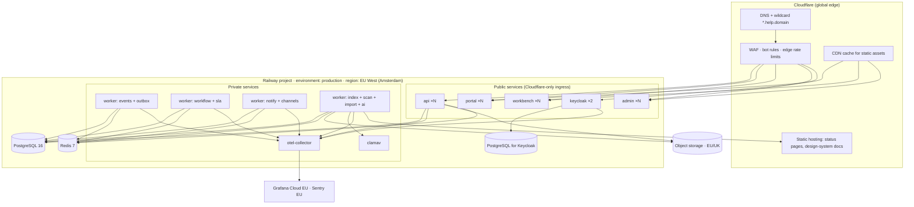
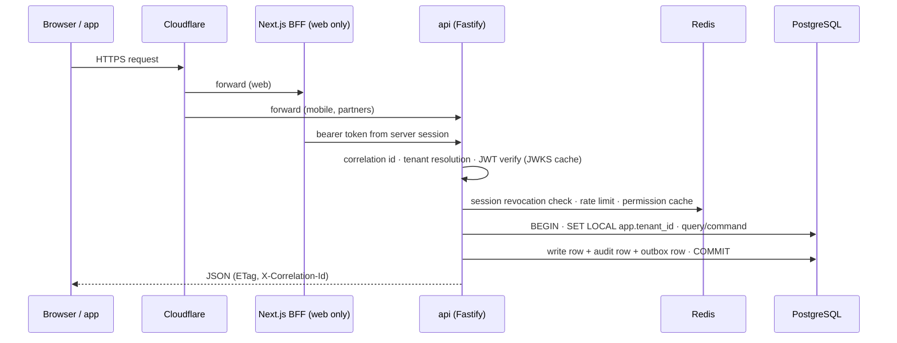
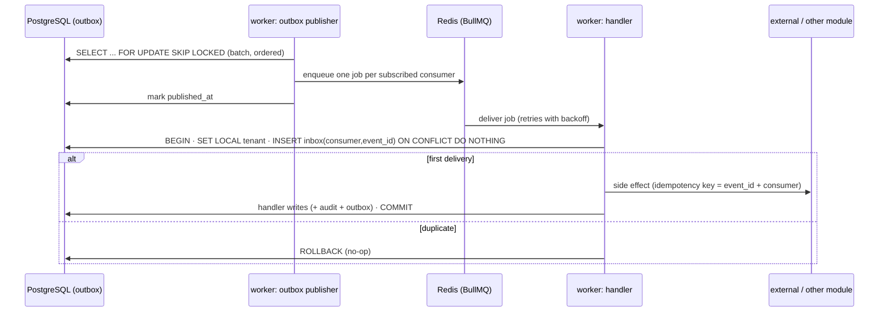

# 03 · Runtime topology (C4 level 2)

## 1. Deployable units

| Unit | Repo path | Runtime | Public? | Scales by | Notes |
|---|---|---|---|---|---|
| `api` | `apps/api` | Node 22 · Fastify · container | Yes (`api.<domain>`) | Horizontal replicas | Mounts every `modules/*` plugin under `/api/v1`; `/api/platform/v1`; `/scim/v2`; SSE endpoint; health, OpenAPI. Stateless. |
| `worker` | `apps/worker` | Node 22 · BullMQ · container | No | Replicas per queue family (see §4) | Same module packages as `api`, different entry point. Runs outbox publisher, event handlers, workflow engine, SLA scheduler, notification dispatch, indexer, scanner, imports, connectors, AI jobs. |
| `portal` | `apps/portal` | Next.js (App Router) · container | Yes (`help.<domain>`, tenant subdomains, custom domains) | Horizontal | Requester portal and user PWA. Thin BFF route handlers exchange the session for a bearer token and proxy API calls unchanged (see 08 §9). |
| `workbench` | `apps/workbench` | Next.js · container | Yes (`desk.<domain>`) | Horizontal | Agent workbench, major-incident room, knowledge authoring, PWA. |
| `admin` | `apps/admin` | Next.js · container | Yes (`admin.<domain>`) | Horizontal | Admin console, platform console (operator role), admin PWA. |
| `status` | `apps/status` | Next.js · container + static export | Yes (`status.<domain>`, custom domains) | Edge-served (public) · horizontal (authenticated) | Public pages are exported by a worker job on status events and deployed to Cloudflare static hosting so they survive API outage; authenticated pages are served by the same app running on Railway (MOD-23). |
| `mobile` | `apps/mobile` | Expo (React Native) · EAS | App stores | n/a | iOS first (PH-2), Android (PH-5). Calls `api` directly with PKCE tokens. |
| `keycloak` | `infra/keycloak` | Keycloak 26 · container | Yes (`auth.<domain>`) | 2 replicas (PH-2+) | Identity broker. Own PostgreSQL database. See [09](09-identity-and-security.md). |
| `clamav` | `infra/clamav` | clamd · container | No | 1–2 | Attachment scanning over the private network. |
| `otel-collector` | `infra/otel` | OpenTelemetry Collector · container | No | 1–2 | Receives OTLP from all units, redacts, batches, exports to Grafana Cloud and Sentry. |
| PostgreSQL 16 | Railway managed | — | No | Vertical; read replica when available | Extensions: `pgvector`, `pg_trgm`, `pgcrypto`, `btree_gin`. Separate logical databases: `platform`, `keycloak`. |
| Redis 7 | Railway managed | — | No | Vertical | Queues (BullMQ), cache, rate-limit counters, pub/sub for SSE, distributed locks. |
| Object storage | Cloudflare R2 (EU jurisdiction) or AWS S3 `eu-west-2` | — | Presigned only | n/a | Attachments, import files, exports, audit export manifests, status-page build artefacts. See [19 · D-01](19-risks-and-decisions.md#d-01). |

## 2. Hosting layout

**In words.** One Railway project holds three environments (`preview-*`, `staging`, `production`), each with the same service graph. In production, the public services are the API, the three Next.js apps and Keycloak; everything else is reachable only on Railway's private network. The worker is one image deployed as four services, each pinned to a queue family so that a burst of AI or indexing work cannot starve outbox publishing or SLA timers. PostgreSQL and Redis are Railway-managed. Object storage and the observability stack are external, EU-jurisdiction services. Cloudflare provides DNS (including the wildcard used for tenant subdomains), WAF, edge rate limiting, caching of static assets and hosting for the static status pages.

### 2.1 Region and residency stance

Railway offers US West, US East, EU West (Amsterdam) and Singapore regions; there is no UK region. The initial deployment therefore runs in **EU West (Amsterdam)**, which satisfies UK GDPR for a UK controller under the UK's adequacy regulations for the EEA. If the steering group requires data *at rest inside the United Kingdom*, the architecture supports two alternatives without structural change, because every data store sits behind a connection string and every deployable is a container:

| Option | Compute | PostgreSQL | Object storage | Trade-off |
|---|---|---|---|---|
| A · EEA under adequacy *(default assumed here)* | Railway Amsterdam | Railway Amsterdam | R2, EU jurisdiction | Simplest; matches the specification's hosting choice. |
| B · Hybrid UK data | Railway Amsterdam | Managed PostgreSQL in London (AWS RDS, Neon or Supabase `eu-west-2`) | S3 `eu-west-2` | ≈ 8–12 ms per round trip between Amsterdam and London; mitigated by fewer round trips per request (see 08 §4 and §8) but material for chatty endpoints. |
| C · Full UK | AWS London (ECS Fargate) | RDS London | S3 London | No Railway; more infrastructure work in PH-1; no later migration. |

This is decision **D-01** in [19 · Risks and decisions](19-risks-and-decisions.md) and must be closed in PH-1 week 1. Tenant records carry `region` from PH-1 so that a later multi-region layout (PH-5, [17](17-evolution-and-extraction.md)) is a data-driven routing change.

## 3. Request paths

### 3.1 Synchronous request (web or mobile → API)

1. Cloudflare applies WAF and edge rate limits, then forwards to the Next.js app (browser) or directly to the API (mobile, integrations).
2. For browsers, the Next.js app holds the session in an `httpOnly` cookie and exchanges it for the bearer access token in a route handler (token-handler pattern). No business logic lives in the BFF.
3. The API assigns or propagates `X-Correlation-Id`, resolves the tenant from the verified token, verifies the JWT against Keycloak's JWKS (cached), checks the session denylist and per-tenant/per-token rate limits in Redis, then executes the use case under a `TenantContext`.
4. Every mutating use case runs in one PostgreSQL transaction that sets `app.tenant_id`, writes the domain rows, the audit event and the outbox event, and commits. The response carries the entity `version` as `ETag`.

### 3.2 Asynchronous path (event → handlers)

The outbox publisher is the only component that moves events from PostgreSQL to Redis. Consumers are registered per module from manifests; the publisher fans out one BullMQ job per consumer. Each handler claims the event in the `inbox` table inside its own transaction, so duplicate deliveries (retries, replays, Redis loss) are no-ops. A reconciliation job re-enqueues outbox rows that were published but never acknowledged by all required consumers within a window, which is what makes Redis loss survivable. Details in [07](07-eventing-and-integration.md).

### 3.3 Scheduled path

BullMQ repeatable jobs drive schedules (SLA minute tick per partition, digest windows, retention jobs, reconciliation, connector schedules, review-date reminders). Every scheduled job is tenant-iterating: it lists active tenants and processes each under its own `TenantContext`, so a tenant with a failing job never blocks another.

### 3.4 Realtime path (SSE)

Workbench and portal open one `GET /api/v1/events/stream` connection per tab. The API subscribes to Redis pub/sub channels `sse:{tenantId}:{userId}` and `sse:{tenantId}:ticket:{ticketId}`; handlers publish lightweight "changed" notices (entity type, id, version) after commit. Clients refetch through the normal API. Sticky sessions are not required. ADR-0015.

### 3.5 Channel inbound path (email in PH-2; chat and voice in PH-4)

Provider → Cloudflare → `POST /api/v1/channels/<channel>/…` → signature verification → `InboundMessage` row (idempotent on the provider's message ID) → enqueue `channel.inbound` job → adapter normalises to a channel command → module service executes under a tenant context with the mapped actor → normal events → outbound renderer posts back to the originating conversation. The synchronous part is the smallest possible (verify, persist, acknowledge) so provider timeouts never lose messages.

## 4. Worker pools and queue families

| Service | Queues | Concurrency guidance | Why separate |
|---|---|---|---|
| `worker-events` | `outbox`, `events:*` (one queue per consumer module), `webhooks`, `reconcile` | Publisher: 1 leader per environment (Redis lock) plus followers idle; handlers: high | Publisher lag is the most important SLI; it must never queue behind slow work. |
| `worker-engine` | `workflow`, `sla:tick:*`, `sla:actions`, `approvals:reminders`, `rules` | Medium; SLA tick partitions spread across replicas | Timer lateness and exactly-once workflow steps need predictable latency. |
| `worker-comms` | `notify:render`, `notify:email`, `notify:push`, `notify:chat`, `channels:inbound`, `channels:outbound`, `surveys` | High; per-provider rate limiters | Provider outages and rate limits must not stall the engine. |
| `worker-data` | `search:index`, `ai:*`, `scan`, `imports`, `exports`, `connectors`, `analytics:project`, `retention`, `status:build` | Low–medium; AI and imports are heavy | Bursty, CPU/IO-heavy, tolerant of delay. |

All four run the same image with `WORKER_QUEUES` set per service. A single-service deployment (preview environments, local) runs all queues in one process.

## 5. Scaling model

| Component | Scaling signal | Mechanism | Limits to watch |
|---|---|---|---|
| `api` | p95 latency, CPU | Add replicas (stateless) | PostgreSQL connections: each replica uses a small pool (10–20); PgBouncer in transaction mode is introduced when replicas × pool > ~200 connections. |
| `worker-*` | Queue depth, job age | Add replicas per family; raise concurrency | Per-provider rate limits; SLA partition count (fixed at 16, rebalanced by replica count). |
| PostgreSQL | CPU, IO, replication lag | Vertical; read replica for analytics and reporting (PH-3); partitioning of `audit_event` and `outbox_event` by month | Long transactions; index bloat on `ticket` (autovacuum tuned). |
| Redis | Memory, ops/s | Vertical; separate instance for queues vs cache when memory > 50 % | Job retention (completed jobs trimmed); pub/sub fan-out. |
| Search | Index size, query p95 | PostgreSQL FTS until PH-3; Meilisearch as a separate service afterwards (ADR-0017) | Freshness < 5 s. |
| Keycloak | Login rate | 2 replicas, own database | Realm size; see [09](09-identity-and-security.md). |

## 6. Environment parity

Every environment runs the same service graph from the same images; only sizes, replica counts and secrets differ. Preview environments (one per pull request) run `api`, one `worker` (all queues), the three web apps, Keycloak in dev mode with a seeded realm, PostgreSQL, Redis and a MinIO-compatible bucket, seeded by the shared seed script. Staging is production-like with test identity providers and sandbox channel accounts. Local development uses `docker-compose` with the same components plus Mailpit for email. See [16](16-deployment-and-delivery.md).

## 7. Failure modes and degradation

| Failure | Behaviour | Mechanism |
|---|---|---|
| Redis unavailable | API keeps serving reads and writes (outbox still records events); rate limiting fails open with alert; SSE reconnects; jobs resume when Redis returns; reconciliation re-enqueues | Outbox as durable source; publisher reconciles `published_at` vs inbox acks. |
| PostgreSQL primary unavailable | API returns 503 with problem details for writes; web apps show status banner; read-only mode against replica *(PH-4)* | Health checks; graceful degradation flag; Railway failover / restore runbook. |
| Keycloak unavailable | Existing sessions continue until token expiry (cached JWKS); new logins fail with clear message | Short access tokens (10 min) with refresh tokens; JWKS cache TTL 1 h. |
| Email/chat provider outage | Notifications queue with backoff up to 24 h; delivery dashboard shows failures; channel health event raised | Per-provider queues and circuit breakers. |
| AI provider outage *(PH-4)* | AI features hidden; no errors shown to requesters | Feature-level health flags set by the gateway. |
| Object storage outage | Uploads fail with retry guidance; existing tickets unaffected | Presigned flow isolates the API from storage availability. |
| Worker crash mid-job | Job retried; side effects deduplicated | Inbox idempotency; workflow step state; idempotency keys on external calls. |
