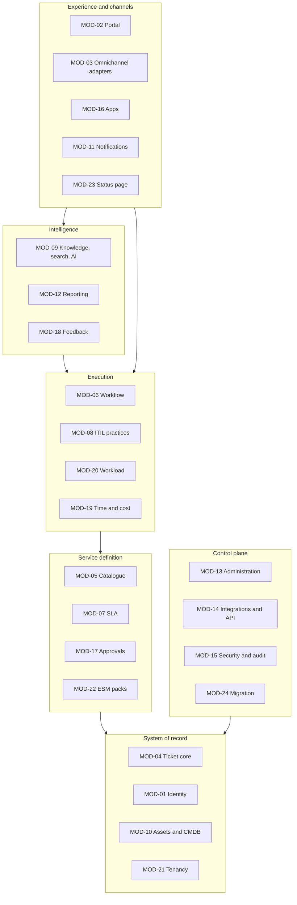

# 04 · Module architecture (C4 level 3)

## 1. Module groups and the dependency direction

The 24 modules from the specification are organised into six groups. Synchronous dependencies point **downwards** in the diagram: an experience module may call execution and system-of-record modules; a system-of-record module never calls an experience module. Upward communication happens through events. Three cross-cutting capabilities are callable from any module regardless of group, because they are reached through `packages/platform` interfaces rather than module-to-module calls: settings and flags (MOD-13), audit and classification (MOD-15), and the notification request API (MOD-11, which only queues work; delivery is asynchronous).



Synchronous dependencies point down the diagram. Events flow the other way: the system-of-record and execution modules publish, and experience, intelligence and control-plane modules consume, so no module ever needs to depend upwards.

`packages/platform` (tenant context, permissions, event bus, jobs, audit, settings, telemetry) sits beneath all groups and is the only shared runtime dependency. `packages/contracts` (schemas and types) is the only way modules share types.

## 2. Module catalogue with boundaries

| Module | Package(s) | Owns (tables / aggregates) | Exposes (service interfaces) | Publishes | Consumes | Depends on (sync) |
|---|---|---|---|---|---|---|
| MOD-01 Identity | `modules/identity` | User, Organisation, Team, TeamMembership, Location, Role, Permission, RoleAssignment, Session, Device, ApiKey, Delegate | `UserService`, `OrgService`, `TeamService`, `RoleService`, `DelegationService`, `SessionService`, `ScimService` *(PH-4)* | `user.*`, `role.assignment.changed`, `auth.*`, `session.revoked` | `tenant.created` | MOD-21, platform |
| MOD-02 Portal | `apps/portal`, `packages/ui`, `modules/portal` (server side of the composed endpoints) | PortalConfig, Draft, DeflectionEvent | `PortalHomeService`, `DraftService` | `portal.deflection.recorded` | `incident.major.*`, `ticket.*` (SSE) | MOD-04, MOD-05, MOD-09, MOD-11, MOD-13 |
| MOD-03 Omnichannel | `modules/channel-email`, `channel-slack`, `channel-teams`, `channel-whatsapp`, `channel-voice`, `modules/channels` (shared adapter framework and conversation state) | ChannelAccount, ChannelIdentity, Conversation, InboundMessage, Transcript | `ChannelAccountService`, `IdentityLinkService`, `ConversationService`, `ChannelCommandBus` | `channel.message.received`, `channel.identity.linked`, `channel.health.degraded` | `ticket.comment.added`, `ticket.status.changed`, `approval.requested` | MOD-04, MOD-01, MOD-11, MOD-14 gateway, MOD-09 *(PH-4)* |
| MOD-04 Ticket core | `modules/ticket`, `apps/workbench` | Ticket, TicketComment, TicketEvent, Attachment, TicketTask, TicketLink, TicketWatcher, SavedView, TicketFieldValue/custom, Category, FieldDefinition, TicketCounter | `TicketService`, `CommentService`, `TaskService`, `AttachmentService`, `LinkService`, `CategoryService`, `FieldDefinitionService`, `TicketQueryService` | `ticket.*` | `sla.timer.*`, `approval.decided`, `user.deactivated`, `ticket.attachment.scanned` | MOD-01, MOD-21; MOD-14 outbox and MOD-15 audit through platform |
| MOD-05 Catalogue | `modules/catalogue`, `modules/forms` | Service, ServiceOffering, RequestType, FormDefinition, FormVersion, FormSubmission, FulfilmentPlan, FulfilmentTaskTemplate, Entitlement, Bundle | `CatalogueService`, `FormService`, `RequestService`, `FulfilmentService` | `request.submitted`, `request.fulfilled`, `catalogue.item.published` | `approval.decided`, `ticket.task.completed`, `asset.updated` | MOD-04, MOD-17, MOD-01, MOD-10 *(PH-4)* |
| MOD-06 Workflow | `modules/workflow`, `modules/rules` | WorkflowDefinition, WorkflowVersion, WorkflowRun, WorkflowStepRun, BusinessRule, ActionDefinition, ErrorQueueItem | `RuleEngine`, `WorkflowService`, `WorkflowRuntime`, `ActionRegistry` | `workflow.run.*`, `rule.applied` | `ticket.*`, `request.submitted`, `approval.decided`, `sla.timer.*`, `schedule.tick` | MOD-04, MOD-17, MOD-11, MOD-14, MOD-13 |
| MOD-07 SLA | `modules/sla`, `packages/business-time` | SlaPolicy, SlaTarget, SlaTimer, BusinessCalendar, CalendarException, PriorityMatrix, EscalationRule, BreachRecord, Entitlement/Tier | `SlaPolicyService`, `TimerService`, `CalendarService`, `BusinessTime` (pure lib) | `sla.timer.*` | `ticket.created/updated/status.changed/assigned/comment.added`, `approval.*` | MOD-04, MOD-01; MOD-11 by events; MOD-20 *(PH-4)* |
| MOD-08 ITIL practices | `modules/incident` *(E1, PH-4)*, `modules/problem` *(E2, PH-4)*, `modules/change` *(E3, PH-4)* | MajorIncident, MajorIncidentUpdate, PostIncidentReview, ActionItem *(E1)*; Problem, KnownError, Change, ChangeWindow, BlackoutWindow, StandardChangeTemplate, MonitoringEvent | `majorIncidentService`, `reviewService`, `domain/lifecycle` *(E1)*; `ProblemService`, `ChangeService`, `AlertCorrelationService` | `incident.major.declared/updated/resolved/closed/update.overdue/review.published` *(E1)*; `problem.created`, `knownerror.published`, `change.*` | `approval.decided`, `ci.relationship.changed`, monitoring events | MOD-04, MOD-01, MOD-11; MOD-17, MOD-10, MOD-20 for E2 and E3 |
| MOD-09 Knowledge, search, AI | `modules/knowledge`, `modules/search`, `modules/ai` | KnowledgeArticle, ArticleVersion, ArticleFeedback, DecisionTree, SearchDocument, Embedding, PromptTemplate, AiJob, AiSuggestion, EvalDataset, EvalRun, AiBudget | `ArticleService`, `SearchService`, `Indexer`, `AiGateway`, `SuggestionService`, `VirtualAgentService` *(PH-4)* | `knowledge.article.*`, `ai.*` | `ticket.*`, `knowledge.*`, `catalogue.item.published`, `asset.*`, `knownerror.published` | MOD-04, MOD-01, MOD-15, MOD-14 |
| MOD-10 Assets and CMDB | `modules/assets` *(E1 and E2, PH-4)* | CiClass, ConfigurationItem, CiRelationship, AssetModel, Asset, AssetAssignment, AffectedCi *(E1)*; DiscoverySource, DiscoveryRun, DiscoveryProposal, ReconciliationRule, Supplier, Contract, ContractCoverage *(E2)* | `ciService`, `assetService`, `impactService`, `linkService` *(E1)*; `discoveryService`, `proposalService`, `contractService` *(E2)* | `ci.registered`, `ci.status.changed`, `ci.retired`, `asset.assigned`, `asset.retired`, `discovery.run.completed`, `discovery.proposal.decided`, `contract.expiring` | nothing, deliberately: discovery proposes and a person confirms (ADR-0028) | MOD-01, MOD-04, MOD-05, MOD-14 |
| MOD-11 Notifications | `modules/notifications` | NotificationTemplate, NotificationRule, Notification, DeliveryAttempt, NotificationPreference, Subscription, DistributionList, StakeholderGroup, DeviceRegistration | `NotificationService`, `TemplateService`, `PreferenceService`, `DeliveryService` | `notification.*` | `ticket.*`, `sla.*`, `approval.*`, `incident.major.*`, `survey.*`, `status.incident.*`, `change.*`, `user.*` | MOD-01, MOD-13 (settings), MOD-03 transports *(PH-4)* |
| MOD-12 Reporting | `modules/analytics` (+ `analytics` schema) | MetricDefinition, Dashboard, DashboardWidget, ReportDefinition, ScheduledReport, Forecast, `analytics.fact_*`, `dim_*` | `MetricService`, `DashboardService`, `ReportService`, `ProjectionBuilder` | `report.generated`, `analytics.drift.detected` | all domain events | MOD-01, MOD-15 |
| MOD-13 Administration | `modules/admin`, `apps/admin` | Setting, SettingVersion, FeatureFlag, FeatureFlagOverride, InstalledModule, ConfigPackage, Environment, MarketplaceListing *(PH-5)* | `SettingsService`, `FeatureFlagService`, `ModuleRegistry`, `ConfigPackageService`, `AdminSearchService` | `config.published/rolled_back`, `module.enabled/disabled`, `package.installed` | `tenant.created` | MOD-01, MOD-15 |
| MOD-14 Integrations and API | `modules/integrations`, `packages/sdk`, `packages/contracts` | OutboxEvent, InboxEvent, WebhookSubscription, WebhookDelivery, IntegrationApp, OAuthClient, Connector, ConnectorCredential, IntegrationLog | `EventBus`, `WebhookService`, `ApiKeyService`, `ConnectorFramework` *(PH-4)*, `BulkJobService` | `integration.*` | all events (webhook fan-out) | MOD-01, MOD-15, MOD-13 |
| MOD-15 Security and audit | `modules/security` | AuditEvent, RetentionPolicy, LegalHold, PrivacyRequest, DataClassification, SecurityAlert, ControlEvidence *(PH-4)* | `AuditWriter` (in platform), `AuditQueryService`, `RetentionService`, `PrivacyRequestService`, `ClassificationService`, `ScanService` | `security.alert.raised`, `audit.export.requested`, `retention.job.completed`, `privacy.request.completed`, `ticket.attachment.scanned` | `auth.login.failed`, `role.assignment.changed`, `api.rate_limited`, `ticket.attachment.added` | MOD-01, MOD-14, MOD-13 |
| MOD-16 Apps | `packages/ui`, `apps/portal`, `apps/workbench`, `apps/admin`, `apps/mobile` | RemoteConfig *(PH-4)*, client-side offline queue | n/a (consumes SDK) | `app.session.started`, `app.error.reported` | `notification.queued` (push) | MOD-01, MOD-14 SDK |
| MOD-17 Approvals | `modules/approvals` | ApprovalPolicy, ApprovalRequest, ApprovalStep, ApprovalDecision, ApprovalDelegation, AuthorityMatrix *(PH-4)* | `ApprovalService`, `ApprovalPolicyService`, `ApproverResolver` | `approval.*` | `request.submitted`, `change.submitted`, `knowledge.article.submitted`, `config.publish.requested`, `user.*` | MOD-01, MOD-04; MOD-11 by events; MOD-15 through platform |
| MOD-18 Feedback | `modules/feedback` | Survey, SurveyVersion, SurveyTrigger, SurveyInvitation, SurveyResponse | `SurveyService`, `ResponseService` | `survey.*` | `ticket.status.changed`, `request.fulfilled`, `incident.major.resolved` | MOD-04, MOD-11, MOD-12 |
| MOD-19 Time and cost | `modules/time` | TimeEntry, ActivityType, CostRate, Budget *(PH-4)* | `TimeEntryService`, `TimerService`, `CostService` | `time.entry.*`, `budget.threshold.reached` | `ticket.status.changed` | MOD-04, MOD-01, MOD-05 |
| MOD-20 Workload | `modules/workload` | AgentAvailability, Shift, ShiftAssignment, OnCallRotation, OnCallOverride, Skill, AgentSkill, RoutingPolicy, AgentRoutingMark *(PH-4)* | `availabilityService`, `onCallService`, `routingService`, `domain/strategies`, `domain/rota` | `workload.assignment.declined`, `workload.oncall.overridden` | `ticket.assigned` | MOD-01, MOD-04, MOD-21 |
| MOD-21 Tenancy | `modules/tenancy` | Tenant, TenantGrant, Plan, PlanFeature, Limit, Subscription, UsageMeter, UsageRecord, Invoice *(PH-5)*, TenantProvisioningJob | `TenantService`, `ProvisioningService`, `PlanService` *(PH-3)*, `MeteringService` *(PH-4)*, `BillingProvider` *(PH-5)* | `tenant.*`, `subscription.changed`, `usage.limit.reached` | `ticket.created`, `ai.job.completed`, `attachment.added`, sampled `api.request` | MOD-01, MOD-13, MOD-15 |
| MOD-22 ESM packs | `modules/esm`, `packs/*` | ServicePack, PackInstallation | `PackService` | `pack.*` | `request.submitted` (cross-department) | MOD-05, MOD-06, MOD-07, MOD-09, MOD-13, MOD-01, MOD-15 |
| MOD-23 Status page | `modules/statuspage`, `apps/status` | StatusPage, StatusComponent, StatusIncident, StatusUpdate, MaintenanceWindow, StatusSubscriber | `StatusPageService`, `StatusPublisher` | `status.*` | `incident.major.*`, `change.scheduled`, monitoring health | MOD-08, MOD-10, MOD-11, MOD-01 |
| MOD-24 Migration | `modules/migration` | ImportJob, ImportMapping, ImportRecord, ImportError | `ImportService`, `Importer` registry | `import.job.*` | — (writes through other modules' services) | MOD-14, MOD-04, MOD-01, MOD-09, MOD-10, MOD-15 |

Deviations from the specification's package and entity tables (proposed; listed as specification change requests in [19 §4](19-risks-and-decisions.md#4-specification-change-requests)):

- **`DeviceRegistration` is owned by MOD-11** rather than MOD-16, because MOD-16 has no server-side module and the notification dispatcher is the only writer of push outcomes; apps register devices through the API.
- **Shared channel code lives in `modules/channels`** (adapter framework, `ChannelCommandBus`, conversation state) rather than in `packages/platform`, so that channel concerns can be extracted with the adapters (17 §3).
- **Business rules live in `modules/rules`** as a sibling of `modules/workflow`, both owned by the same squad, so the PH-2 rules engine ships without the PH-3 workflow package.
- **`modules/portal`** is added for the server side of the composed portal endpoints (`/portal/home`, drafts, deflections); the specification lists only `apps/portal` and `packages/ui`.

`ChannelIdentity` stays with MOD-03 and `Delegate` with MOD-01, exactly as the specification's entity tables state; MOD-17 reads delegations through `DelegationService`.

## 3. Anatomy of a module

Every module package has the same shape. The shape is enforced by a generator (`pnpm gen:module`) and by lint rules, so a squad picking up a new module starts from a working skeleton.

```
modules/<name>/
  manifest.ts          # identity, version, deps, permissions, events, flags, settings, jobs
  index.ts             # registers the Fastify plugin, handlers and jobs from the manifest
  routes/              # Fastify plugin: HTTP only (parse, authenticate is upstream, call service, map errors)
  service/             # use cases; every public method takes TenantContext first; permission checks live here
  domain/              # pure logic: state machines, validators, calculators (no I/O)
  repo/                # Prisma access through the tenant-aware client; the only place SQL/Prisma appears
  events/              # Zod schemas of published events (re-exported into packages/contracts)
  handlers/            # consumers of other modules' events; idempotent; thin (call service)
  jobs/                # BullMQ processors and schedules
  prisma/              # schema.prisma fragment + migrations for this module's tables
  seed/                # default configuration (system roles, templates, policies) applied on tenant.created
  admin/               # optional: settings schemas and admin UI descriptors read by MOD-13
  README.md            # module-level decisions and runbook notes
  __tests__/           # unit (domain), integration (routes/handlers), isolation and permission cases
```

Rules enforced by lint (custom ESLint rules in `packages/config`):

1. `repo/` may import Prisma; nothing else may. `routes/` and `handlers/` may import only from the module's `service/` and from `packages/contracts` and `packages/platform`.
2. A module may import another module **only** through its `index.ts` public exports (service interfaces and event schemas), never from its `repo/`, `prisma/` or internal paths.
3. A module may not reference another module's Prisma model names. Cross-module reads go through the owning service or a read model the consumer maintains from events.
4. No `any` in `events/` or in anything re-exported into `packages/contracts`.
5. Every `service/` mutating method must call `audit.record(...)` and, where a catalogue event exists, `eventBus.publish(tx, ...)` within the same transaction (checked by an integration-test convention: "every mutating endpoint emits audit and outbox rows").
6. Outbound HTTP goes through the MOD-14 gateway; nothing calls `fetch` directly (ADR-0023).
7. Every module is a root dependency, so an integration suite that imports it resolves.
8. JSON is never compared by stringifying it. `JSON.stringify(a) === JSON.stringify(b)` compares writing order, and `jsonb` does not preserve writing order, so the comparison answers "different" for ever once a value has been through the database — silently, and in whichever direction costs most. `jsonEquals` from `packages/platform` is the comparison. The audit hash chain is the one exemption: its ordering predates the helper and cannot change without invalidating every hash already written.

## 4. The manifest

`manifest.ts` is data, read at start-up by the API (to mount routes and register handlers), by the worker (to register jobs), by MOD-13 (to render admin settings and flags, and to enable/disable modules per tenant) and by the permission registry (to seed permission keys and generate the permission-matrix tests).

```ts
export const manifest: ModuleManifest = {
  id: 'MOD-04',
  key: 'ticket',
  version: '1.0.0',
  phase: 'PH-1',
  dependsOn: ['MOD-01', 'MOD-21', 'MOD-14', 'MOD-15'],
  permissions: [
    { key: 'ticket.read', scopes: ['own', 'team', 'any'] },
    { key: 'ticket.create', scopes: ['own', 'any'] },
    { key: 'ticket.update', scopes: ['team', 'any'] },
    { key: 'ticket.comment.internal', scopes: ['team', 'any'] },
    { key: 'ticket.assign', scopes: ['team', 'any'] },
    { key: 'ticket.merge', scopes: ['team', 'any'] },
    { key: 'ticket.close', scopes: ['team', 'any'] },
    { key: 'ticket.config.manage', scopes: ['any'] },
  ],
  events: {
    publishes: ['ticket.created', 'ticket.updated', 'ticket.status.changed', /* … */],
    consumes: ['sla.timer.*', 'approval.decided', 'user.deactivated', 'ticket.attachment.scanned'],
  },
  featureFlags: [
    { key: 'ticket.customFields', default: false, owner: 'core-squad', expires: 'PH-3' },
  ],
  settings: [
    { key: 'ticket.autoClose.days', schema: z.number().int().min(1).max(90), default: 7, scope: ['tenant', 'organisation'] },
  ],
  jobs: [
    { name: 'ticket.autoClose', schedule: '0 * * * *', queue: 'engine' },
  ],
  routesPrefix: '/tickets',
  enabledByDefault: true,
};
```

The `ModuleManifest` schema lives in `packages/platform`. A manifest test asserts that every permission key used in the module's services is declared, every published event has a schema in `events/`, and every consumed event exists in some module's `publishes`.

## 5. Module lifecycle per tenant

- **Install** happens at deployment (the code is present in the image). **Enable** is per tenant, recorded in `InstalledModule` (MOD-13), default from the manifest, gated by the plan *(PH-3)*.
- A disabled module's routes return **404** (never 403, to avoid revealing capability), its job processors skip tenants where it is disabled, and its handlers return early. The schema stays in place; data is retained.
- Enabling a module for a tenant runs its `seed/` (idempotent) under a provisioning job, so default roles, templates and policies exist before the first request.
- Dependencies are checked on enable: a module cannot be enabled unless its `dependsOn` are enabled.

## 6. Cross-module interaction patterns

| Need | Pattern | Example |
|---|---|---|
| Read another module's data during a request | **Synchronous service call** through the public interface, in the same transaction if needed | `TicketService.create` calls `UserService.assertRequester(ctx, id)` and `CatalogueService.resolveRequestType`. |
| React to another module's change | **Event handler** (asynchronous, idempotent) | MOD-07 starts timers on `ticket.created`; MOD-11 renders notifications on `ticket.status.changed`; MOD-23 posts status updates on `incident.major.updated`. |
| Require another module to do something as part of a flow | **Command via service** when it must be atomic; **event** when eventual consistency is acceptable | Merge: `TicketService.merge` atomically moves comments (own tables) and emits `ticket.merged`; notification of the requester is an event consequence. |
| Show combined data | **Composition in the calling module** (or a BFF-style composed endpoint such as `/portal/home`) | `TicketQueryService.timeline` composes comments, events, tasks (own) with approvals via `ApprovalService.listForTicket`. |
| Cross-module transaction that would span two owners | **Avoid**; split into a command plus an event, or move the aggregate | Request submission creates the ticket (MOD-04 service, same transaction as MOD-05's `FormSubmission`) then emits `request.submitted`; approvals start from the event. |
| Configuration another module needs | **Settings service** (MOD-13) with the manifest-declared key, cached and invalidated by `config.published` | MOD-07 reads `sla.pauseOnPendingRequester`. |

A synchronous cross-module call inside a transaction is allowed only when both writes must succeed together. The module that opens the transaction passes it to the other service; both modules write their own tables. This keeps atomicity without letting either module touch the other's tables.

## 7. Ownership and squads

| Squad (from the specification) | Modules | Shared responsibilities |
|---|---|---|
| Platform | MOD-01, MOD-13 (PH-1), MOD-14, MOD-15, MOD-21, MOD-24, `packages/platform`, `infra/` | Foundations, CI/CD, primitives, isolation suite |
| Core | MOD-04, MOD-07, MOD-20 | Ticket record, SLA, routing |
| Experience | MOD-02, MOD-16, MOD-11 (PH-2+), `packages/ui` | Portal, workbench, admin shells, design system |
| Catalogue and workflow | MOD-05, MOD-06, MOD-17, MOD-22 | Configuration builders, expression language, engines |
| ITIL practices | MOD-08, MOD-10, MOD-23 | Major incident, problem, change, CMDB, status |
| Measurement and experience | MOD-12, MOD-18, MOD-19, MOD-13 (PH-3+) | Analytics, feedback, time, admin builders |
| Channels | MOD-03 | Adapters *(PH-2 email, PH-4 chat/voice)* |
| AI and knowledge | MOD-09 | Search, knowledge, governed AI |

`CODEOWNERS` maps `modules/<name>/**` to the owning squad; a pull request touching two modules needs a reviewer from each.
