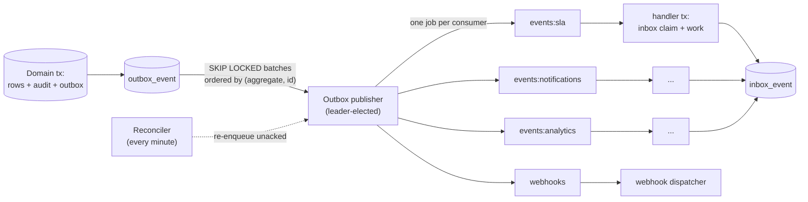
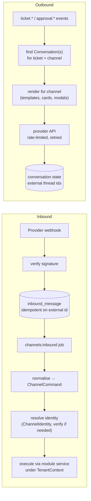

# 07 · Eventing and integration architecture

## 1. The event envelope

Every domain event, whether delivered internally, to a webhook or (later) over NATS/Kafka, has the same envelope. It is defined once in `packages/contracts/events/envelope.ts`.

```ts
interface EventEnvelope<T> {
  id: string;                  // UUID v7, unique, also the idempotency key
  type: string;                // 'ticket.status.changed'
  version: number;             // schema version of payload, starts at 1
  tenantId: string;
  occurredAt: string;          // ISO 8601, transaction commit intent time
  actor: Actor;                // user | api_key | integration | workflow | ai | system | scheduler
  correlationId: string;       // request or job that started the causal chain
  causationId?: string;        // id of the event or command that directly caused this one
  aggregate: { type: string; id: string; version?: number };
  payload: T;                  // validated against the event's Zod schema
  meta?: { source?: 'import' | 'replay'; channel?: string };
}
```

Payload schemas live in the publishing module's `events/` folder and are re-exported from `packages/contracts/events`. Breaking changes bump `version`; consumers register for `type@version`; the previous version is published alongside the new one for one phase (dual-publish) so consumers migrate independently.

## 2. Outbox → publisher → queue → inbox



### 2.1 Tables

```sql
outbox_event (
  id uuid pk, tenant_id uuid, type text, version int, aggregate_type text, aggregate_id uuid,
  aggregate_version int, payload jsonb, envelope jsonb, created_at timestamptz,
  published_at timestamptz null, attempts int default 0, last_error text null
) partition by range (created_at);

inbox_event (
  consumer text, event_id uuid, tenant_id uuid, processed_at timestamptz,
  outcome text,  -- 'done' | 'skipped' | 'failed'
  primary key (consumer, event_id)
) partition by range (processed_at);

consumer_registry (consumer text pk, module text, event_types text[], required boolean);  -- platform table, built from manifests at boot
```

### 2.2 Publisher protocol

1. A leader lock (`lock:platform:outbox-publisher`) ensures one active publisher per environment; followers poll the lock. The publisher polls every 250 ms (and is also woken by `NOTIFY outbox_new`).
2. `SELECT … WHERE published_at IS NULL ORDER BY aggregate_type, aggregate_id, id LIMIT 500 FOR UPDATE SKIP LOCKED`.
3. For each event, look up subscribed consumers from the registry (built from manifests at boot) and `add` one BullMQ job per consumer to `events:{consumer}` with `jobId = {consumer}:{eventId}` (BullMQ deduplicates on `jobId`). Webhook fan-out enqueues one job per matching subscription to `webhooks`.
4. Mark `published_at`. If Redis fails between step 3 and 4, the rows stay unpublished and are retried; duplicate jobs are absorbed by `jobId` and by the inbox.
5. Publisher lag (`now − min(created_at) WHERE published_at IS NULL`) is exported as a metric; alert at > 30 s, SLO p95 < 5 s.

### 2.3 Consumer protocol

```ts
defineHandler({
  consumer: 'sla', event: 'ticket.created', required: true,
  async handle(ctx, event, tx) { /* work using tx */ },
});
```

The platform wrapper: builds `TenantContext` from the envelope → opens `db.transaction(ctx)` → `INSERT INTO inbox_event … ON CONFLICT DO NOTHING`; if zero rows inserted the delivery is a duplicate and the wrapper commits and returns → runs `handle` in the same transaction → commits. Any outbox events the handler publishes are in the same transaction, so cascades are also exactly-once from the consumer's perspective. Handler failures roll back the inbox row (so retries are possible) and are retried with backoff; after the retry budget the job is dead-lettered with `outcome = failed` and surfaced in the admin console.

### 2.4 Ordering

- The publisher enqueues in `(aggregate, id)` order, and BullMQ preserves FIFO per queue under a single worker; with concurrency > 1 or multiple replicas, **ordering across events of the same aggregate is not guaranteed**.
- Handlers are therefore written to be **order-tolerant**: they compare `aggregate.version` with the last version they processed for that aggregate (stored in their own read model or in `inbox_event.outcome`) and skip or re-read the aggregate's current state through the owning service rather than trusting the payload alone.
- Handlers that genuinely need serial processing (SLA timer recompute, workflow run advancement, conversation rendering) take a short per-aggregate lock (`lock:{tenant}:{aggregateType}:{id}`) and requeue with delay on contention.

### 2.5 Reconciliation and replay

- **Reconciler** (every minute): finds outbox rows with `published_at < now − 2 min` for which a `required` consumer has no `inbox_event`, and re-enqueues them. This is what makes Redis loss survivable.
- **Replay CLI** (`pnpm events:replay --tenant T --type ticket.* --from … --to … --consumer analytics`) re-enqueues historical outbox rows for one consumer with `meta.source = 'replay'`; the inbox key is `{consumer}:{eventId}` so replays are no-ops unless the operator passes `--force`, which deletes the inbox rows for that consumer and range first (used for projection rebuilds).
- Outbox partitions are retained for 90 days online (enough for projection rebuilds) and archived afterwards.

## 3. Webhooks (MOD-14-E2b, PH-2)

- `webhook_subscription (tenant_id, url, secret_ref, event_types[], filters jsonb, status, owner_id)`; `webhook_delivery (subscription_id, event_id, attempt, status, response_code, latency_ms, next_attempt_at)`.
- Dispatcher signs the envelope body with HMAC-SHA256 (`X-Signature: t=…,v1=…`, timestamped to prevent replay), sends with a 10 s timeout, retries with exponential backoff up to 24 h (BullMQ delayed jobs), then dead-letters, notifies the subscription owner and shows the delivery in the admin console with a **redeliver** action.
- Subscriptions may filter by organisation and ticket type using the expression language; filters are evaluated by the dispatcher before sending.
- Outbound IPs are documented for allow-listing; a subscription must pass a challenge (`POST` with a nonce echoed back) before activation.
- Delivery logs are retained 30 days; per-subscription rate limits and a circuit breaker (auto-pause after 100 consecutive failures) protect the worker.

## 4. Integration gateway and connectors (MOD-14-E3, PH-4; interfaces defined now)

```ts
interface Connector<Cfg, Cred> {
  kind: string;                                 // 'intune', 'jamf', 'entra-scim', 'github', 'monitoring-generic'
  configSchema: ZodSchema<Cfg>;
  credentialSchema: ZodSchema<Cred>;            // stored encrypted, write-only
  healthCheck(ctx, cfg, cred): Promise<Health>;
  fetch?(ctx, cfg, cred, cursor?): AsyncIterable<ExternalRecord>;   // pull sources
  push?(ctx, cfg, cred, command: OutboundCommand): Promise<Result>; // outbound actions
  webhook?: { verify(req): boolean; parse(req): InboundEvent[] };  // push sources
}
```

- Connectors are registered by modules (MOD-10 owns Intune/Jamf; MOD-01 owns SCIM; MOD-08 owns monitoring; MOD-06 owns generic HTTP actions) and executed by the gateway in `worker-data` with per-connector rate limits, circuit breakers, timeouts and idempotency keys.
- Every call is logged to `integration_log` with redacted bodies and the correlation ID; failures raise `integration.connector.health.changed`; the admin console shows health, last run and logs.
- Credentials: `connector_credential (ref, encrypted_value, kek_version, rotated_at)`; envelope encryption; rotation reminders; never returned by the API after creation.
- Inbound webhooks from any provider land on a **per-kind endpoint** (`/api/v1/channels/<kind>/…`, `/api/v1/events/monitoring`), are verified, persisted (`inbox_event` for events, `inbound_message` for channels) and acknowledged within the provider's timeout; processing is asynchronous.

## 5. The channel-adapter pattern (MOD-03)

Every channel is an adapter with the same three responsibilities; email (PH-2) is the reference implementation the PH-4 adapters copy.



- **Channel commands** are a closed set: `createTicket`, `addComment`, `getStatus`, `decideApproval`, `linkIdentity`, `handoff`. Adapters never call repositories; they call the same services the API uses, with an actor of type `user` (mapped identity) or `channel` (unmapped sender, limited to `linkIdentity`).
- **Identity mapping** (`ChannelIdentity`) is verified before any ticket data is revealed: email by verified address (or mailbox policy for external requesters), Slack/Teams by provider-verified email plus SSO link, WhatsApp by one-time code through a verified channel, voice by number/employee ID plus spoken confirmation.
- **Conversation state** (`Conversation`: ticket, channel account, external thread ID, state JSON) is what makes cross-channel continuity possible: a ticket may have several conversations, and every outbound render fans out to all of them.
- **Loop and abuse protection**: auto-reply detection, per-sender rate limits, duplicate `external_message_id` ignored, size limits, attachment scanning before visibility.
- **Health**: each `ChannelAccount` tracks lag, failure counts and last message; degradation raises `channel.health.degraded` for the admin alert.
- **Provider contract tests**: recorded payloads in `modules/channel-*/__tests__/fixtures` with secrets removed.

## 6. Email transport (OD-03 recommendation)

- Interface `EmailTransport { sendMessage(ctx, msg): Promise<ProviderRef>; parseInbound(req): InboundEmail; verify(req): boolean }`.
- **Recommended default: Postmark** (inbound webhook with JSON-parsed MIME, outbound with message streams, strong deliverability tooling). **Second adapter: Microsoft Graph** for tenants on Microsoft 365 that require mail to stay inside their tenant (shared-mailbox subscription webhooks; outbound via the mailbox). The interface allows per-tenant selection from PH-3.
- Threading: outbound messages carry `Message-ID`, `References` and a signed ticket token in a header and in the subject (`[REQ-000123]`); inbound resolution order is header token → `In-Reply-To`/`References` lookup → subject token → new ticket.
- Residency note: Postmark processes in the US; where a tenant's DPIA rejects that, the Graph adapter keeps mail in the tenant's Microsoft geography. This is part of decision D-01's evidence.

## 7. Transport evolution

The `EventBus` interface has two implementations planned:

| Phase | Publisher side | Consumer side | Why |
|---|---|---|---|
| PH-1 → PH-4 | Outbox → BullMQ fan-out | BullMQ workers with inbox | Simple, one Redis, in-process registry |
| PH-5 (extraction, ADR-0001) | Outbox → NATS JetStream stream per tenant shard (`events.{tenantShard}.{type}`) | JetStream durable consumers per service, still with inbox | Cross-service delivery, replay by sequence, independent scaling |

The outbox table, the envelope, the inbox and handler code do not change; only the publisher's `send` and the worker's `subscribe` adapters do. Kafka is the alternative if a tenant requires it; the interface is transport-neutral.
