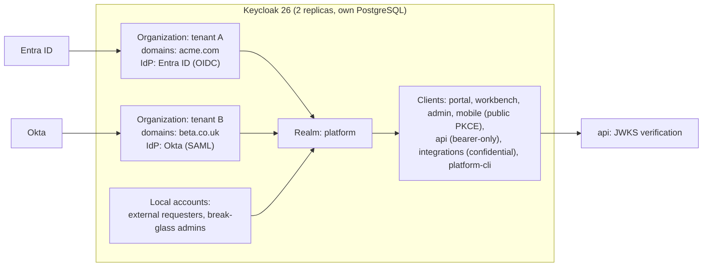

# 09 · Identity and security architecture

## 1. Identity broker: Keycloak (ADR-0011)

The product owner selected self-hosted Keycloak (resolving OD-01). Keycloak is the **only** component that speaks to identity providers; the platform trusts Keycloak-issued tokens and never handles passwords for SSO users.

### 1.1 Topology

- **One realm (`platform`), one Keycloak Organization per tenant.** Keycloak Organizations (GA since Keycloak 26) give each tenant its own identity providers, email domains and membership within a single realm, with identity-first login that routes a user to their tenant's IdP by email domain. This avoids realm-per-tenant, which does not scale operationally beyond tens of tenants and complicates client configuration.
- **Escape hatch:** a tenant with strict isolation needs (regulated MSP client) can be given a dedicated realm; the platform stores `tenant.auth_realm` and the API accepts tokens from a configured set of issuers. Not used at launch.
- **Token mappers** add `tenant_id` (from the Organization attribute), `org_id` (primary organisation, from a user attribute synchronised by the platform), `sid`, `amr`/`acr` and email. Roles are not mapped; authorisation is platform data.
- **Local accounts** exist only for external requesters (email-verified, password or magic link) and break-glass administrators (TOTP required, flagged; every login raises `security.alert.raised`).
- **JIT provisioning:** on first login the platform's `UserService.provisionFromToken` creates the user (email, name, IdP subject) and maps group claims to teams by tenant-configured rules; subsequent logins update changed attributes. SCIM *(PH-4)* becomes the preferred source and JIT falls back to it.
- **MFA policy pass-through:** the tenant setting `auth.requiredAcr` is compared with the token's `acr`/`amr`; below policy → login denied with a clear message and an audit event.
- **Sessions:** Keycloak holds the SSO session; the platform records `session (user_id, sid, device, ip, ua, last_seen, expires_at)` on login and enforces tenant idle/absolute timeouts by refusing refresh beyond them and denylisting `sid` in Redis on revoke (`DELETE /me/sessions/{id}`, admin revoke, SCIM deactivate, break-glass).
- **Passkeys** *(PH-5)* are Keycloak WebAuthn; no platform change.
- **Operations:** Keycloak runs as a Railway service with its own PostgreSQL, behind Cloudflare at `auth.<domain>`, with the admin console restricted by Cloudflare Access to platform operators; realm configuration is exported to `infra/keycloak/realm.json` and applied by a job so that environments are reproducible; theme customised with the design tokens.

### 1.2 Authentication flows

| Flow | Steps |
|---|---|
| Web login | App redirects to Keycloak `/auth` with `kc_idp_hint` or organisation scope derived from the tenant subdomain → identity-first login → IdP → Keycloak issues code → Next.js BFF exchanges code (PKCE) → stores tokens in Redis session → sets `__Host-session` cookie → calls `POST /api/v1/auth/session` so the platform records the session and runs JIT. |
| Mobile login | `expo-auth-session` PKCE against Keycloak → tokens in secure store → `POST /auth/session`. Biometric unlock *(PH-4)* gates local token use. |
| Integration | Client credentials against Keycloak; client attribute `tenant_id`; scopes map to permission sets defined in the admin console. |
| API key | Admin creates key with scopes and expiry; API compares argon2id hash; key is bound to a service user record for audit. |
| Impersonation *(PH-4)* | Admin with `identity.impersonate` starts an impersonation session with reason; `TenantContext.impersonation` is set; every audit event records both identities; banner shown in UI. |
| Break-glass | Local admin in Keycloak, TOTP enforced, allowed only from the admin app; alert and audit on use; password rotated after use per runbook. |

## 2. Authorisation model (ADR-0013)

- **RBAC with scoped assignments** as defined in [05 §3](05-platform-primitives.md#3-authorisation-permission-registry-and-checker): permissions from manifests, roles as sets of `(permission, scope)`, assignments with optional scope targets (organisation subtree, team, service) and validity windows.
- **System roles** seeded per tenant from Appendix B: Requester, Agent, Team lead, Service owner, Administrator, plus the realm-level Platform operator. Tenants can create custom roles from the registry.
- **Checks in the service layer only.** Every public service method resolves the target record first (through its own repo, RLS-scoped), then calls `authz.require`. List queries use `authz.scopeFilter` so results are filtered in SQL.
- **Own / Team / Any** semantics are resolved per aggregate by module-registered scope resolvers; "team" includes organisation-subtree scoped roles, which is how group IT sees all subsidiaries while local agents see their own.
- **ABAC** *(PH-4)*: `abac_policy (permission, predicate expr, effect)` evaluated after RBAC using the expression language over actor, target and environment attributes; used for location, classification, employment status and service constraints.
- **Segregation of duties**: enforced in MOD-17 (requester never approves own request) and in MOD-13 (publisher ≠ approver of a configuration change when the tenant enables it).
- **Permission-matrix tests** are generated from the seed matrix: for every persona × route, expected allow/deny is asserted in CI.

## 3. Tenant isolation layers

| Layer | Mechanism | Test |
|---|---|---|
| Token | Every token resolves to exactly one tenant; host/tenant mismatch → 401 | Integration tests |
| Context | `TenantContext` mandatory; data client refuses without it | Unit + integration |
| Application scoping | Tenant-aware Prisma extension injects `tenant_id` | Isolation suite (Appendix D) |
| Database | RLS enabled and forced; `app_user` cannot bypass or disable | Isolation suite (raw query returns 0 rows; `DISABLE RLS` fails) |
| Keys and paths | Redis, storage, search, job IDs prefixed by tenant | Keyspace scan test; presigned URL cross-read test |
| Cross-tenant (MSP) | Explicit `tenant_grant`, checked in the permission layer, audited with grantee tenant | Grant-scope tests |
| Notifications | Recipient resolution inside the tenant transaction | Cross-tenant notification test |
| Observability | Tenant ID on every span/log; dashboards filter by tenant | Manual check per phase |

## 4. Secrets, keys and encryption

- **In transit:** TLS 1.2+ everywhere; Cloudflare full-strict to origins; Railway private network for internal traffic; mTLS not required in the monolith phase.
- **At rest:** provider-managed encryption for PostgreSQL volumes, Redis and object storage; application-level envelope encryption (AES-256-GCM, per-environment KEK from the secret store, DEK per record) for connector credentials, channel tokens, SCIM tokens and WhatsApp numbers' plaintext (numbers are additionally stored as HMAC hashes for matching).
- **Secrets:** injected as environment variables from Railway's variable store per environment; never in the repository or images; rotation per runbook; `gitleaks` in CI.
- **Signing keys:** webhook HMAC secrets per subscription; public-token signing key (surveys, email approvals) rotated with key IDs; audit export manifests signed with an Ed25519 key held by the platform.
- **Customer-managed keys** *(PH-5)* are a storage and database option, not an application change.

## 5. Audit trail (ADR-0014)

- Append-only `audit_event` written in the same transaction as every state change (see [05 §6](05-platform-primitives.md#6-audit-writer)); hash-chained per tenant; the application role cannot update or delete; monthly partitions; nightly chain verification; signed exports.
- Captured actions: user, admin, integration, workflow, AI, permission decisions that deny, data exports, impersonation, configuration publish/rollback, module enable/disable, tenant lifecycle, security alerts.
- `before`/`after` are redacted by classification at write time so the audit trail itself does not become a leak.
- Audit search API and admin activity log read from the same table; exports include a signed manifest and chain proof.

## 6. Data protection

- **Classification registry:** `data_classification (entity, field, level, masking_rule)` seeded per module (`restricted` for HR ticket types under MOD-22, personal for names/emails/phones, confidential for internal notes). Used by serialisers, loggers, audit redaction, AI context assembly and search ACLs.
- **Retention and erasure:** MOD-15 jobs (see [06 §13](06-data-architecture.md#13-retention-erasure-and-legal-hold)).
- **Privacy requests:** workflow with identity verification, scope preview, legal-hold check, execution, evidence report; erasure pseudonymises rather than deletes where statistics or audit references must survive.
- **Residency:** region on the tenant; buckets per region; AI provider selection per region policy; decision D-01 covers where the primary stores live.
- **DPIA inputs** *(PH-4)*: WhatsApp, voice recordings and AI processing have explicit consent capture (`consent` records on `ChannelIdentity`), per-tenant switches and retention limits.

## 7. Application security controls

| Control | Implementation |
|---|---|
| Input validation | Zod on every request; size limits per route family; HTML sanitised to a safe subset for rich text (server-side allow-list; stored as sanitised HTML plus plain text) |
| Output encoding | React escaping; templates (notifications) escape variables; CSP with nonces on the web apps |
| Security headers | `helmet` in Fastify and Next.js middleware: CSP, HSTS (preload), X-Content-Type-Options, Referrer-Policy, Permissions-Policy, frame-ancestors none (except the embeddable status widget on an allow-list) |
| CSRF | BFF uses SameSite=Lax cookies plus double-submit token on state-changing BFF calls; the API itself is bearer-only |
| Uploads | Presigned PUT with content-type and size limits; ClamAV scan before visibility; MIME sniffing; images re-encoded on render *(PH-3)*; no execution of uploaded content |
| Abuse protection | Cloudflare WAF and rate limits; per-tenant/per-token limits; login attempt limits in Keycloak; `auth.login.failed` bursts raise security alerts; sender rate limits on channels |
| Dependency and container hygiene | `pnpm audit`, Renovate, Semgrep (SAST), Trivy (images), SBOM per build; critical findings block |
| DAST | OWASP ZAP baseline weekly on staging; full scan before PH-2 and PH-4 releases plus external penetration tests |
| Sessions | Short access tokens, sliding refresh within tenant limits, denylist on revoke, device list in profile |
| Logging | Structured, redacted, no secrets or tokens; audit separate from logs |

## 8. Threat model summary (STRIDE, PH-1 scope)

| Threat | Primary mitigations |
|---|---|
| Spoofing (channel identity, forged webhooks) | Keycloak-verified identity only; channel identity verification before data disclosure; provider signatures with timestamp checks |
| Tampering (audit, configuration) | Append-only hash-chained audit; versioned configuration; signed config packages *(PH-3)* |
| Repudiation | Actor and correlation on every audit event; decisions from channels recorded with evidence references |
| Information disclosure (cross-tenant, internal notes, restricted fields) | RLS + scoping + isolation suite; visibility on comments; classification masking; 404 for foreign records; internal notes excluded from requester templates by contract test |
| Denial of service | Cloudflare; rate limits; queue isolation per family; circuit breakers on providers; bulk operations as jobs |
| Elevation of privilege | Permission checks in service layer; scope resolution per aggregate; SoD rules; break-glass alerts; impersonation with reason and audit |

Each module adds a threat-model section to its README at the start of its phase (cross-phase security workstream).

## 9. Compliance readiness

- Controls are tagged in code and runbooks with SOC 2 / ISO 27001 control IDs from PH-1 so that MOD-15-E3 *(PH-4)* collects evidence rather than retrofits it.
- OWASP ASVS level 2 is the checklist for authentication and session management in the MOD-01 definition of done.
