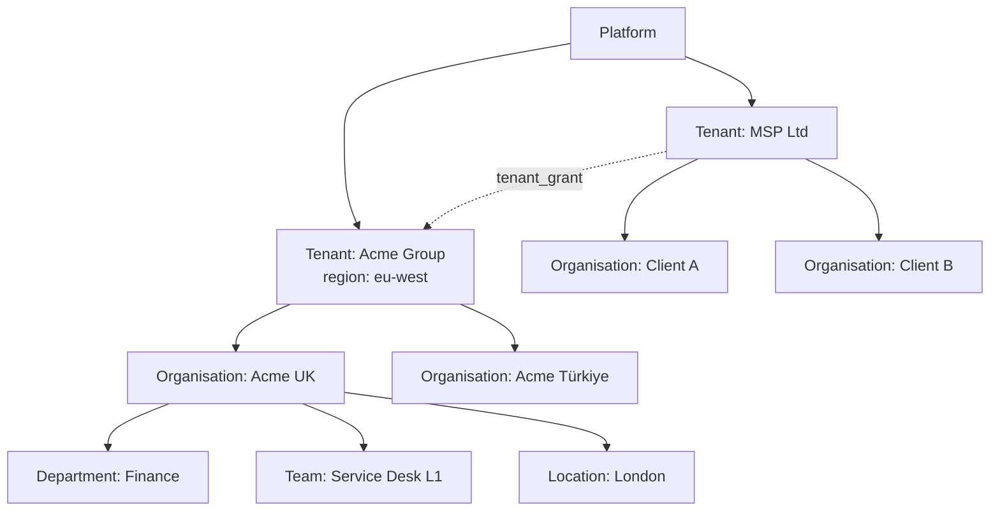
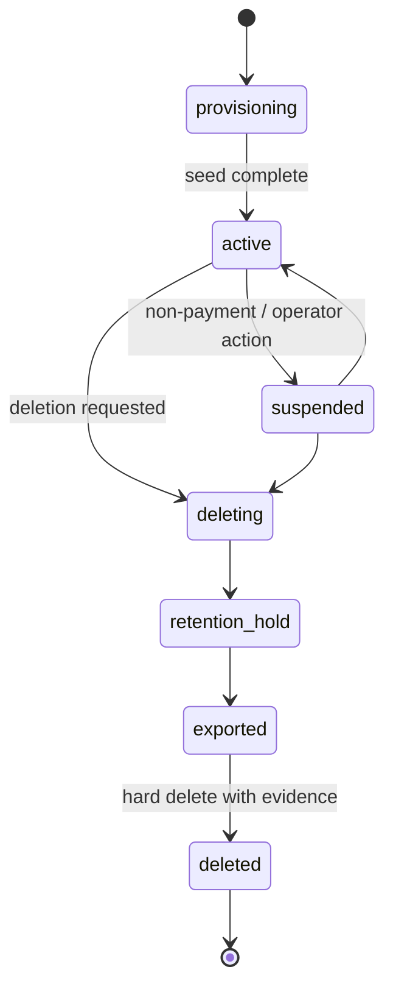

# 10 · Tenancy architecture

## 1. Model

| Level | Entity | Isolation | Configuration | Billing |
|---|---|---|---|---|
| Platform | — | Operators only | Platform defaults | — |
| Tenant | `tenant` | **Hard** (RLS, keys, storage prefixes, search) | Tenant-level settings, modules, flags, plan | Subscription *(PH-3+)* |
| Organisation | `organisation` (nested via materialised path) | **Soft** (permission scopes) so cross-organisation roles work | Overrides tenant settings; own catalogue, forms, SLAs, templates | Roll-up reporting |
| Department / team / location | `team`, `location` | Permission scopes, routing, eligibility | Team-level routing and availability | — |

Design points that the specification requires and this architecture makes concrete:

- **Every row belongs to exactly one tenant.** Organisations are a *soft* boundary inside a tenant, enforced by scoped role assignments, so group IT and MSP agents can span organisations without any RLS bypass.
- **MSP model:** an MSP is a tenant whose organisations are its clients (simple case), *or*, when a client must be its own tenant (own IdP, own data-protection terms), a `tenant_grant (grantee_tenant_id, target_tenant_id, scope, valid_to)` lets named MSP roles act inside the client tenant. The grant is checked in the permission layer; the MSP agent then works in a transaction scoped to the client tenant with an actor annotated by the grantee tenant, and the client's audit trail shows it.
- **Region** is a tenant attribute from PH-1 (`tenant.region`, default `eu-west`). It selects the object-storage bucket and, later, the AI provider region policy and the deployment cell (PH-5).

## 2. Tenant resolution

| Situation | Source of truth | Rule |
|---|---|---|
| Authenticated API call | `tenant_id` claim in the verified token | The only source for data access. |
| Web app pre-login | Host (`{slug}.help.<domain>` or a verified custom domain → `tenant_domain` table) | Used to brand the login page and pass the organisation hint to Keycloak; after login the token's tenant must equal the host tenant or the request is rejected. |
| Public endpoints (status, survey, email approval) | Slug in path or signed token payload | Token-bound; never a query parameter alone. |
| Provider webhooks | `channel_account.external_id` (mailbox, workspace ID, phone number) → tenant | Looked up **after** signature verification. |
| Worker jobs and events | `tenantId` in the job payload / envelope | Always present; jobs without it are rejected. |
| Platform console | Explicit `tenantId` parameter with the `platform_operator` role | Opens a scoped transaction per tenant; never a "no tenant" query. |

## 3. Configuration inheritance

Resolution order for every setting, flag, template and definition: **organisation → parent organisation(s) → tenant → platform default** (from manifests). Implemented once in MOD-13's `SettingsService` and reused by every module through `settings.get`. Definitions (forms, policies, workflows) are looked up the same way: the most specific published version wins, with the resolution path shown in the admin UI ("inherited from Acme Group").

## 4. Tenant lifecycle

**Provisioning** (`TenantProvisioningJob`, target < 2 min): create tenant row → create Keycloak Organization and default clients' mappers → create default organisation → seed system roles, permissions, default policies (SLA P1–P4, priority matrix, calendars), notification templates, default settings and module enablement from manifests → create storage prefix and search index → create break-glass admin → emit `tenant.created`. Each step is idempotent and recorded in `steps`, so a failed provisioning can be resumed.

**Suspension** rejects logins and API calls with `403 tenant_suspended` while keeping data and scheduled retention intact.

**Deletion workflow:** soft-delete (suspended, flagged) → retention hold (configurable, default 30 days) → export package (JSON per aggregate + attachments + audit chain proof, delivered to object storage with a signed manifest) → hard delete per module through each module's `purgeTenant` job → delete Keycloak Organization → evidence record on the platform. The order respects foreign keys and never bypasses RLS: the purge runs with `app.tenant_id` set to the tenant being deleted.

## 5. Modules, plans and flags

- **Modules** are enabled per tenant (`installed_module`), gated by the plan from PH-3 (`plan_feature`). Enabling runs the module's seed.
- **Plans** (built PH-4, ADR-0038): `plan` (with its feature flag keys) and `plan_limit (meter, soft, hard)`, both platform-owned and carrying no `tenant_id`. Four meters — agents, tickets, storage, API calls — are counted as events land and rebuilt nightly from the rows beneath them; the request path reads a **cached verdict**, never a count, and fails open. A soft line warns the tenant's administrators once per period; a hard line refuses the act that grows the meter with 402 and a message naming the plan, and refuses nothing else. A tenant administrator may move its own warning threshold below the hard line, never the hard line itself.
- **Flags** resolve platform default → plan gate → tenant override → organisation override (see [05 §7](05-platform-primitives.md#7-settings-and-feature-flags)).

## 6. Sandbox tenants *(PH-3)*

A sandbox is a normal tenant with `environment.source_tenant_id` set, seeded from an anonymised export of the source tenant under the retention policy. Configuration packages move from sandbox to production through MOD-13's import with diff, impact analysis and transactional apply. No separate deployment environment is needed for tenant-level testing.

## 7. Multi-region readiness *(PH-5)*

- Because every deployable is stateless and every store is per environment, a second region is a second Railway project (or an AWS/Azure deployment) running the same images, with its own PostgreSQL, Redis and bucket: a **cell**.
- A small global control plane (tenant directory: `tenant → cell`) and Cloudflare routing by tenant subdomain send each tenant to its cell. Keycloak may remain global (identity is not tenant data at rest in the same sense) or be deployed per cell for strict residency.
- No cross-cell data access exists; MSP grants across cells are out of scope.
