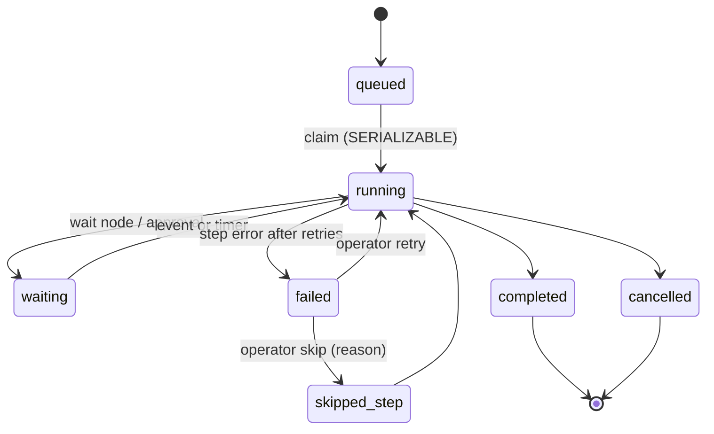

# 11 · Workflow and rules engine

Two engines share one expression language and one versioned-definition lifecycle: the **business rules engine** (MOD-06-E0, PH-2) for synchronous condition/action pairs on ticket events, and the **workflow engine** (MOD-06-E1, PH-3) for durable, multi-step orchestration. Both are interpreters over JSON (ADR-0009); no code generation, no arbitrary scripts.

## 1. Business rules (PH-2)

- `business_rule (id, tenant_id, org_id, name, order, event, conditions expr, actions jsonb, mode: stop|continue, status, version)`.
- Evaluated by the `rules` consumer on `ticket.created`, `ticket.updated`, `ticket.comment.added`, `request.submitted` and on the schedule tick (reminders, auto-close). Rules for one event run in `order`; the first matching rule per action type wins unless `continue`.
- Action types (closed set): `setField`, `setCategory`, `setPriority` (with reason, overriding the impact/urgency matrix), `assignGroup`, `assignStrategy` (delegates to MOD-20, delivered PH-4), `addWatcher`, `addTag`, `sendNotification` (template key), `linkDuplicate`, `setStatus`, `startWorkflow`.
- Each applied rule writes a `TicketEvent` and an audit event with `rule_id` and `version`; publishes `rule.applied`.
- **Test panel:** `POST /rules/{id}/test` replays the last 100 tickets' creation events through the candidate rule set in a dry run and returns what would change; nothing is written.
- Rules execute inside the handler's transaction so they are exactly-once per event; they complete within the handler budget (< 500 ms) or hand off to a workflow.

## 2. Workflow definitions (PH-3)

```json
{
  "schemaVersion": 1,
  "trigger": { "kind": "event", "event": "request.submitted", "when": { "eq": ["requestType.key", "new-starter"] } },
  "nodes": [
    { "key": "approve", "type": "approval", "policy": "manager", "onTimeout": "escalate" },
    { "key": "create-account", "type": "action", "action": "http.entra.createUser", "input": { "email": "{{answers.email}}" }, "retry": { "max": 5 } },
    { "key": "wait-hw", "type": "wait", "until": { "event": "ticket.task.completed", "when": { "eq": ["task.key", "hardware"] } }, "timeout": "P5D" },
    { "key": "notify", "type": "notify", "template": "starter.ready", "to": "requester" },
    { "key": "done", "type": "end", "status": "resolved" }
  ],
  "edges": [
    { "from": "approve", "to": "create-account", "when": { "eq": ["approve.decision", "approved"] } },
    { "from": "approve", "to": "done", "when": { "eq": ["approve.decision", "rejected"] } },
    { "from": "create-account", "to": "wait-hw" }, { "from": "wait-hw", "to": "notify" }, { "from": "notify", "to": "done" }
  ]
}
```

- Node types in P1: `trigger` (event, schedule, manual), `condition`, `setField`, `assign`, `changeStatus`, `createTask`, `approval`, `wait` (timer or event), `notify`, `action` (webhook/HTTP/ticket/user/asset), `end`. *(PH-4)* adds `parallel`/`join`, `subflow`, `compensate`, `humanTask`, `script` (sandboxed, explicitly enabled).
- Variables use a small template syntax `{{path}}` resolved against the run context (ticket, answers, requester, node outputs); conditions use the expression language.
- **Validation** (`POST …/validate`) rejects unreachable nodes, cycles without an exit, unresolved variables, actions the publishing user lacks permission for, and node counts > 200. Validation runs on save and again on publish.
- Definitions follow the versioned-definition lifecycle; publish may require MOD-17 approval; running instances finish on their version; rollback re-activates a previous version.

## 3. Durable execution model



Tables: `wf_run (id, tenant_id, version_id, ticket_id, status, context jsonb, current_keys text[], started_at, ended_at, error)` and `wf_step_run (run_id, step_key, attempt, status, input, output, idempotency_key, started_at, ended_at, error)`.

The engine is a BullMQ processor (`workflow` queue) that advances **one step per job**:

1. **Claim.** Open a `SERIALIZABLE` transaction, load the run and the step to execute, insert `wf_step_run(status = 'started', attempt = n)`. Commit. A concurrent worker attempting the same step fails the unique constraint on `(run_id, step_key, attempt)` and exits.
2. **Execute.** Perform the side effect with `idempotency_key = sha256(run_id + step_key + attempt-independent nonce)`; every action type accepts this key (HTTP actions send it as `Idempotency-Key`; ticket/user/asset actions pass it to the service which stores it; notifications use it as the dispatch key).
3. **Record.** In a new transaction: write `output`, mark `status = 'done'`, compute next nodes from edges, update `wf_run.current_keys`, enqueue one job per next node (`jobId = {run}:{key}:{attempt}`), and publish `workflow.run.step.completed`. Commit.
4. **Waits and timers.** A `wait` node writes `wf_wait (run_id, step_key, kind, event_filter | due_at)`; timers are mirrored as delayed jobs; events are matched by a `workflow` consumer that queries `wf_wait` by event type and filter. On worker boot, `wf_wait` rows with `due_at` and no delayed job are re-scheduled (Redis loss safe).
5. **Failure.** Step errors retry per the node's policy; beyond that the step is `failed`, the run pauses, the owner is notified, and the error queue item is created. Operators can `retry` (new attempt, same idempotency key) or `skip` with reason.

Because step 1 and step 3 are separate transactions with a durable marker between them, a worker killed during step 2 leaves a `started` step; the retry checks the marker and re-executes with the **same idempotency key**, so external systems and notifications deduplicate. This is the design the PH-3 chaos test verifies (100 kills, exactly-once effects).

## 4. Test mode

`POST …/test` runs the definition against selected historical tickets with a **dry-run action registry**: every action records what it would do (inputs, target) without side effects; waits resolve immediately with configurable stub outcomes; approvals take a stub decision. Output is a per-ticket trace. No writes occur outside the test-run table.

## 5. Actions and connectors (MOD-06-E2)

- `action_definition (id, kind, config, credential_ref, retry_policy, timeout_ms, response_mapping)`; kinds: `http`, `email`, `ticket.*`, `user.*`, `asset.*`, `approval.request`, `transform`.
- HTTP actions run through the integration gateway (rate limits, circuit breakers, redacted logs) with the idempotency key header; responses are mapped into the run context with JSONPath-style selectors; failures create error-queue items with a replay tool.
- Credentials are write-only, encrypted, referenced by name (see [09 §4](09-identity-and-security.md#4-secrets-keys-and-encryption)).

## 6. Observability and limits

- Metrics: steps/second, step latency p95 (target < 1 s scheduling latency), runs by status, error-queue size; traces span trigger event → step jobs → external calls.
- Limits: 200 nodes per definition, 10 000 active runs per tenant (soft limit with alert), step execution budget 30 s (long calls are asynchronous actions with callbacks).
- Run history is retained per the retention policy; `wf_step_run` is partitioned monthly.

## 7. Reference workflows

Ten reference workflows ship as a configuration package (new starter access, leaver, hardware request, VIP escalation, auto-close, reminder, major-incident communications, change approval, password reset, satisfaction follow-up). They double as the engine's acceptance tests.
