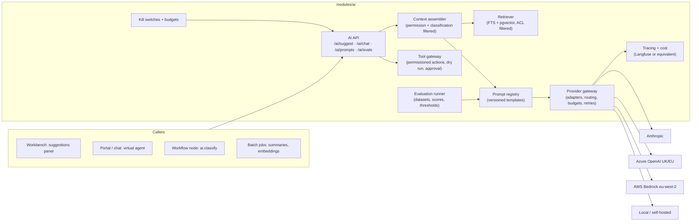

# 13 · AI architecture (governed AI service)

AI is a capability service (ADR-0006), not a feature sprinkled through modules. It is defined now so that PH-1 puts the hooks in place (classification registry, audit actor type `ai`, feature flags, budgets table) and PH-4 builds the service without touching other modules' code.

> **Built in PH-4, against a stub provider (ADR-0040).** The gateway, the
> prompt registry with immutable versions, the evaluation runner and its
> promotion thresholds, per-tenant monthly budgets with a warning line and a
> hard stop at 402, tenant and per-capability kill switches, the context
> assembler under the asker's own permissions, the evidence list, the
> suggestion lifecycle with outcomes, and the retention sweep. Four
> capabilities: `reply-draft`, `ticket-summary`, `article-draft` and
> `similar-work` (retrieval only, no model, no cost).
>
> **Still waiting on OD-04:** the provider itself. Nothing is registered in
> production, so every capability that calls a model is refused rather than
> answered; the stub is registered only outside production. Also waiting: the
> pgvector half of hybrid retrieval in §4, because embeddings from a stub
> would be noise, and the virtual agent, because ADR-0006's line — a person
> reviews before anything reaches a requester — is the line PH-4 keeps.
>
> **Two deviations from what follows.** Prompts live in
> `modules/ai/src/seed/prompts.ts` and are mirrored to the database at boot
> rather than in `modules/ai/prompts/*.md`; a tenant may override tone and
> language, which are MOD-13 settings rather than prompt fields. And the AI
> budget is MOD-09's own table rather than a MOD-21 meter — the reasoning is
> in ADR-0040.
>
> **A second kind of call (ADR-0051).** Generation writes prose for a person.
> A *decision* answers typed questions (one of a closed list, a score, yes or
> no) with a confidence per answer. Decisions have their own gateway entry
> (`decide`), a provider chain per purpose that never leaves the tenant's
> regions, and four modes per tenant (`off`, `shadow`, `suggest`, `auto`). In
> `auto` mode, and only there, two routing fields may be applied without a
> person: category (with its subcategory) and assignment group, each only
> when empty and only once the desk's own record has earned it. §6.2
> describes this.

## 1. Principles that shape the design

1. **No module calls a model provider.** Everything goes through `AiGateway` in `modules/ai`.
2. **The AI never sees more than the actor.** Context is assembled under the requesting actor's `TenantContext` and the classification registry; restricted fields are excluded before any prompt is built.
3. **Every output is explainable:** reason, confidence band, evidence (articles, tickets, fields), prompt version and model are stored with the suggestion and shown in the UI.
4. **Every action is governed:** suggestions are advisory; actions require permission checks, dry run, approval unless explicitly auto-approved for low risk, and evidence capture.
5. **Evaluated before shipped:** prompt versions carry evaluation scores; a prompt cannot be promoted below its feature's threshold; the evaluation suite runs in CI on prompt changes.
6. **Budgeted and switchable:** per-tenant monthly budgets with alert thresholds; tenant-level and per-feature kill switches effective within 10 s (flag cache TTL and invalidation event).
7. **Residency-aware:** the provider and its region are chosen per tenant from `tenant.region` and `tenant.ai_policy` (e.g. UK tenants default to a provider endpoint in the UK/EEA where available).

## 2. Components

| Component | Responsibility |
|---|---|
| **AI API** | `POST /ai/suggest` (async job; result via SSE), `POST /ai/chat` (streamed), suggestion outcomes, governance endpoints (prompts, evals, budgets, kill switch). |
| **Context assembler** | Builds the prompt context from the ticket, requester, related records and retrieved documents using the actor's permissions and `classification.mask`; records the evidence list. |
| **Retriever** | Hybrid retrieval: PostgreSQL FTS (or Meilisearch) for lexical + `embedding` cosine search, both filtered by tenant, ACL and audience **before** ranking; re-ranking optional; returns citations with chunk offsets. |
| **Prompt registry** | `prompt_template (key, version, template, model_policy, status, evaluated_at, scores)` in the repository (`modules/ai/prompts/*.md` with front matter) and mirrored to the database on deploy; per-tenant overrides of tone and language only. |
| **Provider gateway** | Adapters (`AnthropicProvider`, `AzureOpenAIProvider`, `BedrockProvider`, `OpenAICompatibleProvider` for local models, and a decision engine such as `JEVProvider`) behind one interface (`complete`, `decide`, `stream`, `embed`, `moderate`). Routing by task kind, tenant policy and region; retries, timeouts, circuit breakers; token and cost accounting per call. Decisions fail over along a per-purpose chain, and only between providers inside the tenant's regions (ADR-0051). |
| **Tool gateway** *(PH-5)* | Registers actions (password reset, device diagnostics, access request initiation, remediation) with permission requirements, dry-run implementations, risk levels and evidence capture; the same permission and audit model as ordinary integrations. |
| **Evaluation runner** | Datasets (seeded from PH-2/3 tickets, anonymised), metrics (accuracy, groundedness, safety, PII leakage, cost), thresholds per feature; runs via Promptfoo in CI and on demand; red-team suites. |
| **Tracing and cost** | Every call traced (prompt version, model, tokens, latency, cost, tenant, correlation) to Langfuse (self-hosted or EU cloud) and to the platform's metrics; `ai_job` rows keep the durable record. |
| **Kill switches and budgets** | `ai.enabled` (tenant), `ai.feature.<kind>` flags; `ai_budget (tenant_id, monthly_limit, spent, thresholds)`; the gateway refuses calls over hard limit and emits `ai.budget.threshold`. |

## 3. Data flow for a suggestion

1. Workbench calls `POST /ai/suggest { kind: 'reply-draft', ticketId }` → API validates the flag, budget and permission (`ai.suggest`) → enqueues `ai:suggest` job → returns `202` with job ID.
2. Worker builds context: ticket (public + internal as permitted), requester profile (masked), last N similar resolved tickets and top-k articles from the retriever (ACL-filtered), all recorded as `evidence`.
3. Prompt template `reply-draft@v3` renders with the context; the gateway routes to the tenant's provider; the response is parsed into the suggestion schema (`{ text, reason, confidence }`).
4. `ai_suggestion` row stored with evidence, prompt version, model, tokens and cost; `ai.suggestion.created` published; SSE notice sent; audit event with actor `ai` and `causation_id` of the request.
5. Agent accepts/edits/rejects → `POST /ai/suggestions/{id}/outcome` → outcome recorded and later joined with ticket outcomes (reopen, CSAT) for the evaluation dashboards.

## 4. RAG pipeline (PH-4)

- **Ingestion:** `ai:embed` consumer on `knowledge.article.published`, `ticket.status.changed → resolved` (public resolution notes), `catalogue.item.published`; chunking by headings/paragraphs (≈ 400 tokens, overlap 50); `content_hash` skips unchanged chunks; ACL copied from the source's search ACL; embeddings via the gateway's `embed` with the tenant's provider; stored in `embedding` (pgvector).
- **Retrieval:** filter (tenant, ACL, audience, classification, locale) → lexical candidates (top 50) ∪ vector candidates (top 50) → optional cross-encoder re-rank → top-k with citations.
- **Answering:** the virtual agent answers only from retrieved evidence; below a confidence threshold it says so and offers ticket creation; the user is told they are talking to an AI; human handoff is available at every turn and the transcript attaches to the ticket.
- **Quality loop:** article helpfulness, unanswered-question reports (weekly job), retrieval hit rates.

## 5. Governance controls mapped to the PH-4 release gate

| Gate requirement | Control |
|---|---|
| Evidence display | `evidence` stored and rendered; UI components in `packages/ui` (`AiSuggestionCard`) |
| Permission enforcement | Context assembler runs under actor context; tool gateway checks permissions per action |
| Human override | Generated suggestions are never auto-applied; actions need approval unless low-risk auto-approved by policy. Decisions may apply two routing fields (category, assignment group) in `auto` mode, only when empty, each with a one-click undo, and withdraw themselves when people correct too many (ADR-0051) |
| Audit record | Every job, suggestion, outcome and action writes audit events with actor `ai` and the human's identity as `on_behalf_of` |
| Evaluation result | Prompt promotion blocked below threshold; scores visible in admin |
| Kill switch | Tenant and per-feature flags; effective ≤ 10 s; runbook |
| DPIA | Provider DPAs, region policy, retention of prompts/completions (default 30 days, configurable) |

## 6. Residency and provider policy

- `tenant.ai_policy { allowedProviders[], region, retainPrompts, allowTraining: false }`.
- Default for UK/EEA tenants: Azure OpenAI (UK South / Sweden Central) or AWS Bedrock (`eu-west-2` London) endpoints; Anthropic direct where the tenant accepts the provider's processing terms; local models (self-hosted OpenAI-compatible) for tenants that forbid external processing.
- Prompts and completions are stored in the platform database (tenant-scoped, classified `confidential`) for audit and evaluation, not with the provider beyond the provider's transient processing.

### 6.1 What is built (ADR-0042)

OD-04 is closed: `AI_PROVIDER=anthropic` with `ANTHROPIC_API_KEY` registers
the adapter, `stub` throws at boot in production, and unset means every
capability that calls a model refuses with a 503 naming the configuration.

Three things this section describes are **not** built, and each is a real
constraint rather than a detail:

- **Residency is built; the rest of `tenant.ai_policy` is not** (ADR-0047).
  `tenant.ai_allowed_regions` states where a tenant's prompts may be processed;
  a provider declares its own `processingRegion`, or `null` when it makes no
  external call; and the gateway refuses a call outside the list rather than
  falling back to another provider — a fallback would be this platform deciding
  on a customer's behalf that somewhere else is close enough. An empty list
  means "wherever this tenant's own data lives", resolved against
  `tenant.region`. The check runs *before* the prompt is rendered, so a
  forbidden call never interpolates ticket text into a prompt at all. Written
  through `PUT /api/platform/v1/tenants/:id/ai-regions`, which is a platform
  door rather than a tenant one: a tenant that could widen its own residency
  could remove the control.

  What is still missing from §5's `ai_policy` is the rest of it — there is no
  per-tenant **provider** allow-list, no per-tenant retention setting and no
  `allowTraining` flag. Generation still has one provider per deployment, so a
  tenant whose allowed regions exclude it is refused rather than routed to a
  second one. Decisions are the exception (§6.2): their chain may move to
  another provider, but only to one that is also inside the tenant's regions.
- **No Azure, Bedrock or self-hosted adapter.** The socket takes them
  (`registerAiProvider`); nobody has written them.
- **Prices are configuration, not code** (`AI_MODEL_PRICES`, micro-pence per
  thousand tokens). A model with no price is refused before it is called,
  because a budget that cannot see a cost is not a budget. Only the stub is
  priced in code.
- **The default model belongs to the provider.** A call that names no model
  gets `AI_DEFAULT_MODEL`, or the provider's first model when that is unset.
  A default the provider does not offer stops the process at boot; one with no
  price is logged as an error at boot, and every call against it is refused.
  It used to be the constant `stub-small`, which every real provider refused.

The prompt is also the reason the adapter does not go through the integration
gateway, which is otherwise the only way out of the platform (ADR-0023): the
gateway records request bodies to `integration_log`, and a prompt is a
rendered ticket. It would be copied into a table with a different retention
policy and a different audience.

### 6.2 Decisions (ADR-0051)

A decision is a structured call: a purpose, a masked state, and named typed
questions. It returns one answer and one confidence per question. The first
purpose is `triage` (type, category, subcategory, assignment group, and
priority as a suggestion only).

| Concern | Rule |
|---|---|
| When it runs | After the ticket exists, as a `ticket.created` consumer. Intake never waits for it and never fails because of it. |
| Provider chain | Per purpose, for example `jev → anthropic → rules`. A provider is skipped when it is outside the tenant's regions, unpriced, open-circuited, timed out or over budget, and the reason is recorded. `rules` makes no call and leaves the ticket as intake left it. |
| Modes | `off` (default), `shadow` (record only), `suggest` (≥ 0.60 becomes an advisory suggestion), `auto` (≥ 0.90 may be applied). Thresholds are tenant settings; mode changes need `ai.manage` and are audited. |
| What `auto` may change | Category (with subcategory) and assignment group, only when empty. Never a field that already has a value. Never type (fixed when a ticket is raised), priority, impact, urgency, major incident, escalation or status. |
| Earning and losing `auto` | Earned per field, checked on every decision: ≥ 95% agreement with people over ≥ 200 settled decisions at or above the auto threshold in the last 90 days. Lost automatically when people correct > 5% of the last 100 applied decisions: the purpose steps down to `suggest`, and administrators are told in-app and by email. |
| SLA | `ticket.classified` triggers a re-match of targets. The clock that started at creation keeps running. |
| Record | `ai_decision`: provider, model, question-set version, answers and confidences, latency, tokens, cost, chain attempts, outcome, and the value people settled on. Cost counts toward the AI budget. |
| Credentials | Environment or secret store only. Never from a tenant, never stored, never logged. A decision provider must declare its processing region; none is assumed. |

The JEV adapter is not written until its documentation, limits, region and
data-processing terms have been verified. Until then `triage` runs
`anthropic → rules` (and `stub` outside production).

**What is built (foundation, no behaviour change).**

- The decision contract (`DecisionRequest`, `Decision`) and optional
  `AiProvider.decide`.
- Named providers in the registry (`addAiProvider`, `providerNamed`).
- The gateway's `decide`: chain walking, residency, price and budget skips,
  per-provider timeouts, one retry, and a deployment-wide circuit breaker
  reusing MOD-14's `CircuitBreakers`.
- The pure policy in `domain/decisions.ts`: the catalogue, answer checking,
  planning, scoring, the `auto` gate and the step-down.
- `ai_decision`, with its cost counted in the monthly budget.
- `runTriage` and the read-only `GET /ai/decisions`.
- The Anthropic adapter now runs on the official SDK and answers `decide`
  through structured outputs. The stub answers `decide` deterministically.

**Shadow triage (Phase 3, still no behaviour change).**

- **What runs:** a `ticket.created` consumer queues `ai.decide` for tickets
  that arrive untriaged: email, portal, Slack, Teams, WhatsApp, voice and
  mobile. Tickets raised through `api` (agents and integrations), `import`
  and `system` are skipped, because a person or a migration already chose
  their fields. The job is keyed by ticket, and `runTriage` refuses a second
  decision for the same ticket and question set, so a redelivered event
  cannot spend twice. The purpose is still `off` until a tenant turns it on.
- **Model:** triage asks Anthropic with Claude Sonnet 5, chosen for shadow
  triage as a strong classifier at about a third of the drafting model's
  cost. When a deployment does not offer that model, the provider's default is
  used. The model still needs a price, or the provider is skipped as
  `unpriced`.
- **Scoring against the desk:** when a ticket reaches `resolved`, a
  `ticket.status.changed` consumer writes what it was resolved as onto every
  triage decision about it: type, category, group, priority, and whether a
  major incident was declared from it and not stood down. A reopened ticket is
  settled again when it is resolved again. `GET /ai/decisions/score` computes
  accuracy, the Brier score, calibration bands and the `auto` gate per field
  from those rows, on request, with nothing stored to drift.
- **Where it shows:** the admin console's **AI triage** page (`ai.read`)
  shows the totals, accuracy by field, calibration, and who answered or was
  passed over. Its list of recent decisions needs `ai.manage`, because a list
  of every decision is a list of every triaged ticket. `GET /ai/decisions` for
  one ticket follows the ticket's own visibility, and anyone who cannot see
  the ticket gets a 404.
- **Residency in the worker:** a queued job's context is rebuilt from its
  envelope, which names the tenant but not its regions. `aiRegions` read that
  as the default region. Both worker paths, `runTriage` and the existing
  `runSuggestionJob`, now read the tenant's regions from its row
  (`tenantAiRegions`), so the last check before a prompt leaves is the
  tenant's own policy (ADR-0047).

**Suggest mode (Phase 4, advisory only).**

A desk may choose `suggest` at any time. A suggestion changes nothing until an
agent accepts it, and the AI triage page puts current accuracy beside the
choice.

- **What agents see:** answers at or above the suggest threshold appear as a
  "Suggested triage" card on the ticket in the workbench
  (`GET /ai/triage/:ticketId`). It needs `ai.read` and sight of the ticket.
  Nothing is shown in `shadow` or `off`.
- **Accept:** each answer says what an agent may do with it.
  - Category and priority can be accepted through the ticket update, and the
    team through assignment. Accepting is the agent's own edit, under their
    name and permissions and with the version they loaded, so a ticket that
    changed under them is a 409, not an overwrite.
  - Type can only be dismissed, because a ticket's type is fixed when it is
    raised.
  - A major-incident answer is a warning and is never applied from a
    suggestion. It is shown only when it says yes.
- **When a suggestion disappears:** once it is accepted or dismissed, once
  the ticket already has the value, or once a person changes the field away
  from what it was when the decision was made. `ai_decision.baseline` records
  those fields.
- **What is recorded:** each response is kept on `ai_decision.responses`,
  audited as `ai.suggestion.accepted` or `ai.suggestion.dismissed`, and
  counted per field on the AI triage page.
- **Where suggestions live:** triage suggestions stay on `ai_decision` rather
  than `ai_suggestion`. They are typed answers with a decision's provenance,
  not generated prose with evidence, and scoring reads them from one place.
- **No declaration screen:** the workbench has no screen for declaring a
  major incident, so the warning points the agent to the desk's own process
  rather than linking to one.

**Auto mode (Phase 5).**

A desk may choose `auto` at any time, because choosing it is not what lets an
answer act. Each allow-listed field is applied only once the desk's own record
has earned it, and that is checked on every decision.

- **What it sets:** category and assignment group, at or above the auto
  threshold (0.90), and only when the field is empty. Type, priority and a
  major-incident call stay suggestions. A field that has not earned it yet is
  suggested exactly as in `suggest`.
- **The gate:** `gatesFor` reads the desk's settled decisions from the last 90
  days: ≥ 95% agreement over ≥ 200 answers at or above the auto threshold, per
  field. The AI triage page and every decision call the same function. An
  applied value nobody changed before resolution counts as agreement; one a
  person changed counts against it.
- **How it writes:** in its own transaction after the decision is recorded,
  through `ticketService.applyAutomatedChange` as actor `ai`, with each field
  expected to still hold what the decision saw. A rule or person who got
  there first wins, and that answer becomes a suggestion. Each application is
  audited (`ai.decision.applied`), recorded on `ai_decision.applied`, and
  published as `ticket.classified`. Rules react to it as they would to a
  person's edit. The group is set as a field, as a rule sets it, so no
  assignment notification is sent.
- **SLA:** the SLA module re-matches on `ticket.classified`. Time used is
  counted from creation on the new policy's calendar, less time paused, so the
  clock is never restarted and never loses the hours before the
  classification.
- **Undo:** the workbench card shows what the AI set as "Set by AI" with an
  Undo (`POST /ai/decisions/:id/applied/:question/undo`). Undo puts back the
  previous value as the agent's own edit, with their version, and records the
  correction (`ai.decision.undone`). A value somebody has since changed is
  theirs and can't be undone from here.
- **Corrections and the step-down:** a person (actor `user`) changing an
  applied field is recorded as a correction (`ai.decision.overridden`) by
  `ticket.updated` and `ticket.assigned` consumers. The AI's own writes and a
  rule's are not. Each correction queues `ai.decision.review`. When more than
  5% of the last 100 applied decisions were corrected, the review writes the
  mode setting back to `suggest` under an advisory lock, audits
  `config.published` and `ai.decision.stepped_down`, and publishes
  `ai.decision.stepped_down` to the tenant's administrators, in the console
  and by email. Values already set keep their Undo.
- **The AI triage page** shows which fields auto sets and which it only
  suggests, a "Set by AI" column (set, and how many were corrected), the
  step-down meter, and the last step-down.
- **Budget alerts now arrive:** `ai.budget.threshold` had been published with
  no notification rule. The same pack now delivers it to administrators.

Three things differ from the plan, deliberately:

- **Question sets live in code, versioned** (`questionSetVersion`), like the
  capability catalogue. They are not yet prompt-style tables. A tenant cannot
  edit a question, so a table would add a promotion path with nothing to
  promote.
- **There is no combined usage view yet.** Cost per ticket is on
  `ai_decision` and `ai_job`, and the month's total is on `ai_budget`. A
  reporting view belongs with the analytics work that would read it.
- **There is no `AI_PROVIDERS` list yet.** Its first use is registering a
  second provider, which is the JEV adapter.

## 7. What PH-1 must include for this design

- `Actor.type = 'ai'` and `on_behalf_of` in the audit and event envelopes.
- Classification registry and `classification.mask` hook in serialisers.
- Feature-flag framework with fast invalidation; `ai_budget` table and `usage` meter keys reserved.
- pgvector extension enabled; `embedding` table migration deferred to PH-4.
- Search ACL model (`search_document.acl`) that the retriever reuses.
