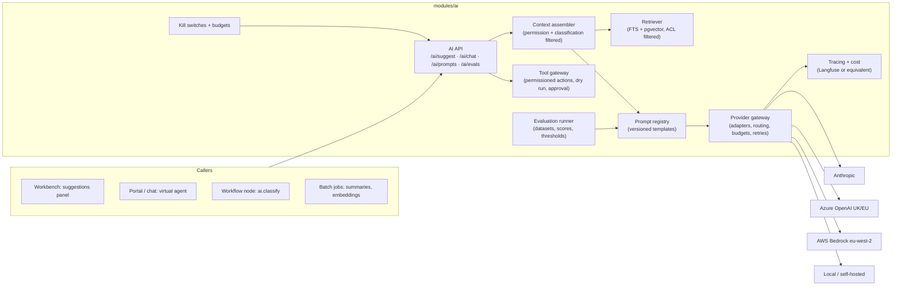

# 13 · AI architecture (governed AI service)

AI is a capability service (ADR-0006), not a feature sprinkled through modules. It is defined now so that PH-1 puts the hooks in place (classification registry, audit actor type `ai`, feature flags, budgets table) and PH-4 builds the service without touching other modules' code.

## 1. Principles that shape the design

1. **No module calls a model provider.** Everything goes through `AiGateway` in `modules/ai`.
2. **The AI never sees more than the actor.** Context is assembled under the requesting actor's `TenantContext` and the classification registry; restricted fields are excluded before any prompt is built.
3. **Every output is explainable:** reason, confidence band, evidence (articles, tickets, fields), prompt version and model are stored with the suggestion and shown in the UI.
4. **Every action is governed:** suggestions are advisory; actions require permission checks, dry run, approval unless explicitly auto-approved for low risk, and evidence capture.
5. **Evaluated before shipped:** prompt versions carry evaluation scores; a prompt cannot be promoted below its feature's threshold; the evaluation suite runs in CI on prompt changes.
6. **Budgeted and switchable:** per-tenant monthly budgets with alert thresholds; tenant-level and per-feature kill switches effective within 10 s (flag cache TTL and invalidation event).
7. **Residency-aware:** the provider and its region are chosen per tenant from `tenant.region` and `tenant.ai_policy` (e.g. UK tenants default to a provider endpoint in the UK/EEA where available).

## 2. Components

| Component | Responsibility |
|---|---|
| **AI API** | `POST /ai/suggest` (async job; result via SSE), `POST /ai/chat` (streamed), suggestion outcomes, governance endpoints (prompts, evals, budgets, kill switch). |
| **Context assembler** | Builds the prompt context from the ticket, requester, related records and retrieved documents using the actor's permissions and `classification.mask`; records the evidence list. |
| **Retriever** | Hybrid retrieval: PostgreSQL FTS (or Meilisearch) for lexical + `embedding` cosine search, both filtered by tenant, ACL and audience **before** ranking; re-ranking optional; returns citations with chunk offsets. |
| **Prompt registry** | `prompt_template (key, version, template, model_policy, status, evaluated_at, scores)` in the repository (`modules/ai/prompts/*.md` with front matter) and mirrored to the database on deploy; per-tenant overrides of tone and language only. |
| **Provider gateway** | Adapters (`AnthropicProvider`, `AzureOpenAIProvider`, `BedrockProvider`, `OpenAICompatibleProvider` for local models) behind one interface (`complete`, `stream`, `embed`, `moderate`); routing by task kind, tenant policy and region; retries, timeouts, circuit breakers; token and cost accounting per call; failover to a secondary provider where the tenant policy allows. |
| **Tool gateway** *(PH-5)* | Registers actions (password reset, device diagnostics, access request initiation, remediation) with permission requirements, dry-run implementations, risk levels and evidence capture; the same permission and audit model as ordinary integrations. |
| **Evaluation runner** | Datasets (seeded from PH-2/3 tickets, anonymised), metrics (accuracy, groundedness, safety, PII leakage, cost), thresholds per feature; runs via Promptfoo in CI and on demand; red-team suites. |
| **Tracing and cost** | Every call traced (prompt version, model, tokens, latency, cost, tenant, correlation) to Langfuse (self-hosted or EU cloud) and to the platform's metrics; `ai_job` rows keep the durable record. |
| **Kill switches and budgets** | `ai.enabled` (tenant), `ai.feature.<kind>` flags; `ai_budget (tenant_id, monthly_limit, spent, thresholds)`; the gateway refuses calls over hard limit and emits `ai.budget.threshold`. |

## 3. Data flow for a suggestion

1. Workbench calls `POST /ai/suggest { kind: 'reply-draft', ticketId }` → API validates the flag, budget and permission (`ai.suggest`) → enqueues `ai:suggest` job → returns `202` with job ID.
2. Worker builds context: ticket (public + internal as permitted), requester profile (masked), last N similar resolved tickets and top-k articles from the retriever (ACL-filtered), all recorded as `evidence`.
3. Prompt template `reply-draft@v3` renders with the context; the gateway routes to the tenant's provider; the response is parsed into the suggestion schema (`{ text, reason, confidence }`).
4. `ai_suggestion` row stored with evidence, prompt version, model, tokens and cost; `ai.suggestion.created` published; SSE notice sent; audit event with actor `ai` and `causation_id` of the request.
5. Agent accepts/edits/rejects → `POST /ai/suggestions/{id}/outcome` → outcome recorded and later joined with ticket outcomes (reopen, CSAT) for the evaluation dashboards.

## 4. RAG pipeline (PH-4)

- **Ingestion:** `ai:embed` consumer on `knowledge.article.published`, `ticket.status.changed → resolved` (public resolution notes), `catalogue.item.published`; chunking by headings/paragraphs (≈ 400 tokens, overlap 50); `content_hash` skips unchanged chunks; ACL copied from the source's search ACL; embeddings via the gateway's `embed` with the tenant's provider; stored in `embedding` (pgvector).
- **Retrieval:** filter (tenant, ACL, audience, classification, locale) → lexical candidates (top 50) ∪ vector candidates (top 50) → optional cross-encoder re-rank → top-k with citations.
- **Answering:** the virtual agent answers only from retrieved evidence; below a confidence threshold it says so and offers ticket creation; the user is told they are talking to an AI; human handoff is available at every turn and the transcript attaches to the ticket.
- **Quality loop:** article helpfulness, unanswered-question reports (weekly job), retrieval hit rates.

## 5. Governance controls mapped to the PH-4 release gate

| Gate requirement | Control |
|---|---|
| Evidence display | `evidence` stored and rendered; UI components in `packages/ui` (`AiSuggestionCard`) |
| Permission enforcement | Context assembler runs under actor context; tool gateway checks permissions per action |
| Human override | Suggestions are never auto-applied; actions need approval unless low-risk auto-approved by policy |
| Audit record | Every job, suggestion, outcome and action writes audit events with actor `ai` and the human's identity as `on_behalf_of` |
| Evaluation result | Prompt promotion blocked below threshold; scores visible in admin |
| Kill switch | Tenant and per-feature flags; effective ≤ 10 s; runbook |
| DPIA | Provider DPAs, region policy, retention of prompts/completions (default 30 days, configurable) |

## 6. Residency and provider policy

- `tenant.ai_policy { allowedProviders[], region, retainPrompts, allowTraining: false }`.
- Default for UK/EEA tenants: Azure OpenAI (UK South / Sweden Central) or AWS Bedrock (`eu-west-2` London) endpoints; Anthropic direct where the tenant accepts the provider's processing terms; local models (self-hosted OpenAI-compatible) for tenants that forbid external processing.
- Prompts and completions are stored in the platform database (tenant-scoped, classified `confidential`) for audit and evaluation, not with the provider beyond the provider's transient processing.

## 7. What PH-1 must include for this design

- `Actor.type = 'ai'` and `on_behalf_of` in the audit and event envelopes.
- Classification registry and `classification.mask` hook in serialisers.
- Feature-flag framework with fast invalidation; `ai_budget` table and `usage` meter keys reserved.
- pgvector extension enabled; `embedding` table migration deferred to PH-4.
- Search ACL model (`search_document.acl`) that the retriever reuses.
